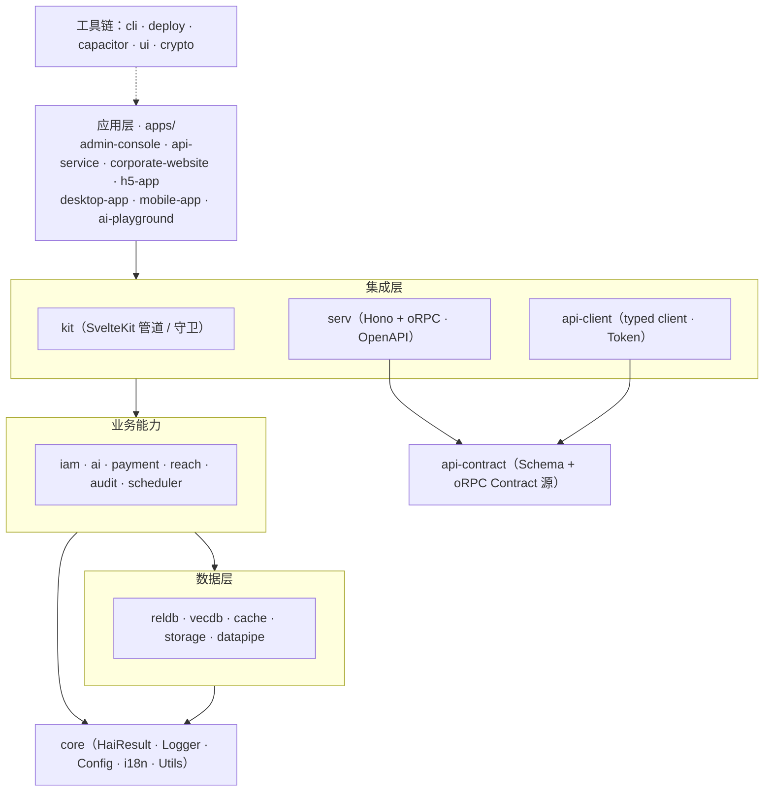

# hai Framework

> 当前处于 `0.1.0-alpha` 阶段：公共契约仍在演进。生产采用前请锁定版本，并针对自身场景完成安全与容量验证。

<p align="center">
  <strong>AI Runtime · 企业级全栈模块 · Agent Skills · 端到端类型安全</strong>
</p>

<p align="center">
  面向 AI 应用的 TypeScript 全栈框架 —— 从一次 LLM 调用，到可交付的企业级应用。
</p>

<p align="center">
  <a href="./LICENSE"></a>
  
  
  
</p>

---

## 简介

hai Framework 是一个以 **AI Runtime 为核心、企业能力按需组合、面向 AI 编程助手优化** 的 TypeScript 全栈开发框架。

最小场景仅需 `@h-ai/ai` 即可完成 LLM 与工具调用；当业务需要持久化、多租户、认证、审计、API、UI 或部署时，再按需组合 `reldb`、`vecdb`、`iam`、`audit`、`serv`、`ui` 等模块。框架不强制任何应用一次性引入完整技术栈。

框架以统一的 API 风格整合了四类能力，使 AI 助手能够端到端地构建功能完整的智能应用：

- **AI 能力** —— LLM 对话、文生图、语音（ASR / TTS）、MCP 协议、工具调用、RAG 与向量检索
- **安全能力** —— 国密加密、身份认证、RBAC 授权、审计日志
- **数据能力** —— 关系数据库、缓存、对象存储、数据管线
- **运营能力** —— 支付、用户触达、定时任务、自动化部署

## 核心特色

| 特色                  | 说明                                                                       |
| --------------------- | -------------------------------------------------------------------------- |
| **AI-First 设计**     | 每一处 API 设计都优先保证 AI 编程助手能够正确使用；AI 用得对，人也用得顺。 |
| **统一生命周期**      | 有状态模块遵循 `init() → use → close()`，一种模式贯穿全部模块。            |
| **显式失败语义**      | 领域操作统一返回 `HaiResult<T>`，成功与失败在类型层面强制区分。            |
| **配置即校验**        | Zod Schema 在 `init()` 阶段完成校验，配置错误在启动时暴露，而非运行时。    |
| **按需组合**          | 21 个独立发布的模块，最小依赖 `@h-ai/core`，按业务场景逐步引入。           |
| **端到端类型安全**    | 严格模式 TypeScript，`api-contract → serv → api-client` 全链路类型推断。   |
| **多端 UI**           | 90 个 Svelte 5 Runes 组件（原子 / 组合 / 场景），覆盖桌面与移动端。        |
| **脚手架与部署**      | `hai create` 创建完整项目，`hai deploy` 部署并自动开通基础设施。           |
| **Agent Skills 内置** | 每个模块随附标准化 Skill 文件，AI 助手可直接获取正确用法。                 |

## 设计理念

**"AI-First" 并非"仅供 AI 使用"，而是让框架的每一个设计决策都优先考虑 AI 编程助手能否正确使用。** 当 AI 能正确使用时，人类开发者的体验同样更好。

多数框架面向人类开发者设计，强调灵活与自由、以约定代替强制。但当由 AI 编写代码时，这种自由会带来不确定性：模式选择、错误处理、日志规范都可能因缺乏约束而不一致。hai Framework 通过统一的契约、可执行的规范与随附的 Skill，让 AI 在生成代码时保持风格一致、类型安全、错误处理完整，并输出人类可审查的结果。

这一理念具体落实为以下设计决策：

| 设计决策                          | 对 AI 的价值         | 对人的价值                     |
| --------------------------------- | -------------------- | ------------------------------ |
| 统一生命周期 `init → use → close` | 只需掌握一种使用模式 | 模块行为可预期                 |
| `HaiResult<T>` 领域返回值         | 主流程显式处理失败   | 减少业务 try-catch，调用链清晰 |
| Zod 配置校验                      | 配置错误即时反馈     | 启动即校验，运行时不失控       |
| Provider 模式                     | 切换后端仅需改配置   | 多环境无缝迁移                 |
| 严格 TypeScript                   | 类型推断引导正确调用 | 重构有保障                     |
| Skill 文件 + LLMS.txt             | 自动获取正确用法     | 生成代码质量更高               |
| 可执行编码规范                    | 每次改动自动遵循     | 代码风格一致，降低评审成本     |

> **关于失败语义**：领域操作优先返回 `HaiResult<T>` —— 成功为 `{ success: true, data }`，失败为 `{ success: false, error }`。`AsyncIterable`、客户端传输、回调与 SvelteKit 控制流等必须抛出异常的边界，在类型与文档中单独标注。

## 技术栈

| 层面       | 选型                                                           |
| ---------- | -------------------------------------------------------------- |
| 语言       | TypeScript 5.7+（严格模式）                                    |
| 运行时     | Node.js ≥ 22.12.0                                              |
| 前端框架   | Svelte 5（Runes）+ SvelteKit 2                                 |
| UI         | Tailwind CSS 4 + DaisyUI 5 + Bits UI v2                        |
| API 契约   | oRPC + Zod + OpenAPI 3.1（`api-contract → serv → api-client`） |
| API 服务   | Hono + oRPC + Scalar 文档页                                    |
| 关系数据库 | SQLite / PostgreSQL / MySQL（原生 SQL，非 ORM）                |
| 向量数据库 | LanceDB / pgvector / Qdrant / Chroma                           |
| 缓存       | 内存 / Redis（单机 / Cluster / Sentinel）                      |
| 对象存储   | 本地文件系统 / S3 兼容（AWS / MinIO / 阿里云 OSS）             |
| AI         | OpenAI 兼容 API + MCP 协议                                     |
| 加密       | 国密 SM2 / SM3 / SM4                                           |
| 支付       | 微信支付 / 支付宝 / Stripe                                     |
| 桌面端     | Tauri                                                          |
| 移动端     | Capacitor（Android / iOS）                                     |
| 构建       | pnpm + Turborepo + Vite + tsup                                 |
| 部署       | Vercel + Neon（PG）+ Upstash（Redis）+ Cloudflare R2（S3）     |

## 快速入门

### 环境要求

- Node.js ≥ 22.12.0
- pnpm ≥ 9.0.0

### 创建新项目

```bash
# 全局安装 CLI
pnpm add -g @h-ai/cli

# 交互式创建项目（选择应用类型与功能模块）
hai create my-app

# 指定模板类型
hai create my-app --type admin      # 管理后台
hai create my-app --type api        # API 服务
hai create my-app --type website    # 企业官网
hai create my-app --type h5         # H5 移动应用

# 进入项目并启动
cd my-app && pnpm install && pnpm dev
```

### 代码生成

```bash
hai generate page dashboard         # 生成页面
hai generate component UserCard     # 生成组件
hai generate api users              # 生成 API 路由

# 快捷别名
hai g:page dashboard
hai g:component UserCard
```

### 一键部署

```bash
hai deploy                          # 部署当前项目到 Vercel
hai deploy --skip-provision         # 跳过基础设施自动开通
```

### 在现有项目中集成

`@h-ai/core` 为必装基础，其余模块按需引入：

```bash
pnpm add @h-ai/core                 # 基础能力（必装）
pnpm add @h-ai/ai                   # AI / LLM / MCP / 文生图 / 语音
pnpm add @h-ai/reldb                # 关系数据库
pnpm add @h-ai/vecdb                # 向量数据库
pnpm add @h-ai/iam                  # 身份认证 / 授权
pnpm add @h-ai/ui                   # UI 组件库
# …按需添加其余模块
```

> 也可在已有项目根目录运行 `hai add <module>` 增量启用模块，CLI 会自动解析依赖并补全配置。

## 功能清单

框架当前提供 **21 个独立发布的模块**，按职责分为五层。

### 基础能力

| 包名           | 职责                                                                                              | Provider 支持 |                                             npm 最新版                                              |
| -------------- | ------------------------------------------------------------------------------------------------- | :-----------: | :-------------------------------------------------------------------------------------------------: |
| `@h-ai/core`   | 框架基石：`HaiResult` 类型、日志（child 上下文）、配置加载、ID 生成、i18n、错误定义体系、工具函数 |       —       |   [](https://www.npmjs.com/package/@h-ai/core)   |
| `@h-ai/crypto` | 国密算法：SM2 非对称加密/签名、SM3 哈希、SM4 对称加密、密码哈希                                   |       —       | [](https://www.npmjs.com/package/@h-ai/crypto) |

### 数据层

| 包名             | 职责                                                                 |              Provider 支持              |                                               npm 最新版                                                |
| ---------------- | -------------------------------------------------------------------- | :-------------------------------------: | :-----------------------------------------------------------------------------------------------------: |
| `@h-ai/reldb`    | 关系数据库：DDL、原生 SQL、事务、分页、CRUD 仓库                     |         ✅ SQLite / PG / MySQL          |    [](https://www.npmjs.com/package/@h-ai/reldb)    |
| `@h-ai/vecdb`    | 向量数据库：集合管理、向量插入、相似度搜索                           | ✅ LanceDB / pgvector / Qdrant / Chroma |    [](https://www.npmjs.com/package/@h-ai/vecdb)    |
| `@h-ai/cache`    | 缓存与分布式锁：KV、Hash、List、Set、SortedSet、Lock，Redis 风格 API |            ✅ Memory / Redis            |    [](https://www.npmjs.com/package/@h-ai/cache)    |
| `@h-ai/storage`  | 文件存储：上传/下载/删除/复制/预签名 URL                             |              ✅ Local / S3              |  [](https://www.npmjs.com/package/@h-ai/storage)  |
| `@h-ai/datapipe` | 数据管线：文本清洗、7 种分块模式、可组合管线（纯函数，无需 init）    |                    —                    | [](https://www.npmjs.com/package/@h-ai/datapipe) |

### 业务能力

| 包名              | 职责                                                                                                                         |       Provider 支持        |                                                npm 最新版                                                 |
| ----------------- | ---------------------------------------------------------------------------------------------------------------------------- | :------------------------: | :-------------------------------------------------------------------------------------------------------: |
| `@h-ai/iam`       | 身份与访问管理：认证（密码/OTP/LDAP）、RBAC 授权、会话管理、用户管理                                                         |             —              |       [](https://www.npmjs.com/package/@h-ai/iam)       |
| `@h-ai/reach`     | 用户触达：邮件、短信、API 回调，模板引擎、免打扰（DND）                                                                      | ✅ SMTP / 阿里云短信 / API |     [](https://www.npmjs.com/package/@h-ai/reach)     |
| `@h-ai/ai`        | AI 集成：LLM 对话（同步/流式）、文生图、语音（ASR/TTS）、工具调用、MCP、Embedding、RAG/知识库、记忆、上下文管理、Rerank、A2A |  ✅ OpenAI 兼容 / 可扩展   |        [](https://www.npmjs.com/package/@h-ai/ai)        |
| `@h-ai/payment`   | 统一支付：订单创建、多端调起、回调通知                                                                                       | ✅ 微信 / 支付宝 / Stripe  |   [](https://www.npmjs.com/package/@h-ai/payment)   |
| `@h-ai/audit`     | 审计日志：操作记录、分页查询、统计聚合、定时清理                                                                             |             —              |     [](https://www.npmjs.com/package/@h-ai/audit)     |
| `@h-ai/scheduler` | 定时任务：Cron 调度、JS 函数 / HTTP API 执行、DB 持久化、分布式锁、执行日志                                                  |             —              | [](https://www.npmjs.com/package/@h-ai/scheduler) |

### 集成层

| 包名                 | 职责                                                                                                    | Provider 支持 |                                                   npm 最新版                                                    |
| -------------------- | ------------------------------------------------------------------------------------------------------- | :-----------: | :-------------------------------------------------------------------------------------------------------------: |
| `@h-ai/api-contract` | 公共 HTTP API 契约：oRPC contract + Zod，按应用组合领域 contract，输出统一 `HaiResult<T>`               |       —       | [](https://www.npmjs.com/package/@h-ai/api-contract) |
| `@h-ai/serv`         | API Service 运行时：Hono + oRPC，挂载 contract / procedures，生成 OpenAPI 3.1 与 Scalar 文档            |       —       |         [](https://www.npmjs.com/package/@h-ai/serv)         |
| `@h-ai/kit`          | SvelteKit 集成：Handle Hook、中间件、路由守卫、表单校验、同源 endpoint 工具（不承载公共 HTTP contract） |       —       |          [](https://www.npmjs.com/package/@h-ai/kit)          |
| `@h-ai/api-client`   | 跨端 typed client：基于 `api-contract` 调用嵌套方法，Bearer / httpOnly cookie Token 管理、401 刷新      |       —       |   [](https://www.npmjs.com/package/@h-ai/api-client)   |
| `@h-ai/capacitor`    | 移动端桥接：安全 Token 存储、设备信息、推送通知、相机、状态栏                                           |       —       |    [](https://www.npmjs.com/package/@h-ai/capacitor)    |

### 界面与工具

| 包名           | 职责                                                                             |                     Provider 支持                     |                                             npm 最新版                                              |
| -------------- | -------------------------------------------------------------------------------- | :---------------------------------------------------: | :-------------------------------------------------------------------------------------------------: |
| `@h-ai/ui`     | UI 组件库：90 个 Svelte 5 Runes 组件（20 原子 + 36 组合 + 34 场景），15 精选主题 |                           —                           |     [](https://www.npmjs.com/package/@h-ai/ui)     |
| `@h-ai/cli`    | CLI 脚手架：项目创建、模块添加、代码生成、一键部署                               |                           —                           |    [](https://www.npmjs.com/package/@h-ai/cli)    |
| `@h-ai/deploy` | 自动化部署：Vercel 部署 + 基础设施自动开通（数据库 / 缓存 / 存储 / 邮件 / 短信） | ✅ Vercel / Neon / Upstash / R2 / Resend / 阿里云短信 | [](https://www.npmjs.com/package/@h-ai/deploy) |

### 模块文档索引

| 分类       | 模块                 | README                                                                 |
| ---------- | -------------------- | ---------------------------------------------------------------------- |
| 基础能力   | `@h-ai/core`         | [`packages/core/README.md`](./packages/core/README.md)                 |
| 基础能力   | `@h-ai/crypto`       | [`packages/crypto/README.md`](./packages/crypto/README.md)             |
| 数据层     | `@h-ai/reldb`        | [`packages/reldb/README.md`](./packages/reldb/README.md)               |
| 数据层     | `@h-ai/vecdb`        | [`packages/vecdb/README.md`](./packages/vecdb/README.md)               |
| 数据层     | `@h-ai/cache`        | [`packages/cache/README.md`](./packages/cache/README.md)               |
| 数据层     | `@h-ai/storage`      | [`packages/storage/README.md`](./packages/storage/README.md)           |
| 数据层     | `@h-ai/datapipe`     | [`packages/datapipe/README.md`](./packages/datapipe/README.md)         |
| 业务能力   | `@h-ai/iam`          | [`packages/iam/README.md`](./packages/iam/README.md)                   |
| 业务能力   | `@h-ai/reach`        | [`packages/reach/README.md`](./packages/reach/README.md)               |
| 业务能力   | `@h-ai/ai`           | [`packages/ai/README.md`](./packages/ai/README.md)                     |
| 业务能力   | `@h-ai/payment`      | [`packages/payment/README.md`](./packages/payment/README.md)           |
| 业务能力   | `@h-ai/audit`        | [`packages/audit/README.md`](./packages/audit/README.md)               |
| 业务能力   | `@h-ai/scheduler`    | [`packages/scheduler/README.md`](./packages/scheduler/README.md)       |
| 集成层     | `@h-ai/api-contract` | [`packages/api-contract/README.md`](./packages/api-contract/README.md) |
| 集成层     | `@h-ai/serv`         | [`packages/serv/README.md`](./packages/serv/README.md)                 |
| 集成层     | `@h-ai/kit`          | [`packages/kit/README.md`](./packages/kit/README.md)                   |
| 集成层     | `@h-ai/api-client`   | [`packages/api-client/README.md`](./packages/api-client/README.md)     |
| 集成层     | `@h-ai/capacitor`    | [`packages/capacitor/README.md`](./packages/capacitor/README.md)       |
| 界面与工具 | `@h-ai/ui`           | [`packages/ui/README.md`](./packages/ui/README.md)                     |
| 界面与工具 | `@h-ai/cli`          | [`packages/cli/README.md`](./packages/cli/README.md)                   |
| 界面与工具 | `@h-ai/deploy`       | [`packages/deploy/README.md`](./packages/deploy/README.md)             |

### 常见初始化顺序

多数项目可按下列顺序初始化模块，既符合依赖关系，也便于 AI 助手推断：

`core → reldb / cache / storage / vecdb → iam / audit / scheduler / reach → ai / payment → api-contract → serv → kit / api-client / ui / capacitor`

- `iam` 依赖已初始化的 `reldb` 与 `cache`
- `audit` 依赖已初始化的 `reldb`
- `scheduler` 启用 DB 持久化时建议先初始化 `reldb`；若 `cache` 已初始化，会自动启用分布式锁能力
- `reach`、`payment`、`ai` 会按功能场景复用下游模块能力，详细配置以各模块 README 为准
- `api-contract` 无需初始化，只描述公共 HTTP API 的 schema 与 oRPC contract
- `serv` 在业务模块初始化后创建 Hono app，`contract` 与 `procedures` 形状必须对应
- `kit` 保留 SvelteKit Hook / guard / 同源 endpoint 能力；跨端公共 API 不在 `kit` 中定义
- `api-client` 在 Web / App / SSR 侧消费同一个应用级 contract，默认返回 `HaiResult<T>`

## 架构



**依赖方向**：上层依赖下层，`@h-ai/core` 是最底层基础，不反向依赖任何模块。公共 HTTP API 统一遵循 **`api-contract`（定义）→ `serv`（实现 / 挂载）→ `api-client`（调用）**；`kit` 只负责 SvelteKit 管道与同源 endpoint，不承载跨端公共 contract。

## 使用示例

以下为各能力组的代表性片段。业务变量与 schema 需结合具体应用补齐；完整 API、错误码与更多范例见各模块 README 与根目录 [`LLMS.txt`](./LLMS.txt)。

### HaiResult 错误处理

领域操作以 `HaiResult` 表达失败语义；流式迭代、网络客户端、框架控制流与第三方回调可能抛出异常，应按对应 API 文档在边界捕获：

```typescript
import type { HaiResult } from '@h-ai/core'
import { core, err, HaiCommonError, ok } from '@h-ai/core'

function divide(a: number, b: number): HaiResult<number> {
  if (b === 0)
    return err(HaiCommonError.VALIDATION_ERROR, 'Division by zero')
  return ok(a / b)
}

const result = divide(10, 2)
if (result.success) {
  const quotient = result.data // 5
}
else {
  core.logger.warn('Division failed', { code: result.error.code, message: result.error.message })
}
```

### 关系数据库

```typescript
import { reldb } from '@h-ai/reldb'

const initResult = await reldb.init({ type: 'sqlite', database: './data/app.db' })
if (!initResult.success)
  throw new Error(initResult.error.message)

// DDL — 建表
await reldb.ddl.createTable('users', {
  id: { type: 'TEXT', primaryKey: true },
  email: { type: 'TEXT', notNull: true, unique: true },
  name: { type: 'TEXT' },
}, true)

// 参数化查询与分页
const users = await reldb.sql.query<User>('SELECT * FROM users WHERE name = ?', ['Alice'])
const page = await reldb.sql.queryPage<User>({
  sql: 'SELECT * FROM users',
  pagination: { page: 1, pageSize: 20 },
})

// 事务
await reldb.tx.wrap(async (tx) => {
  await tx.execute('INSERT INTO users (id, email) VALUES (?, ?)', ['1', 'a@b.com'])
  await tx.execute('INSERT INTO logs (action) VALUES (?)', ['user_created'])
})

// CRUD 仓库（自动生成 SQL）
const userRepo = reldb.crud.table<User>({
  table: 'users',
  idColumn: 'id',
  select: ['id', 'email', 'name'],
  createColumns: ['id', 'email', 'name'],
  updateColumns: ['email', 'name'],
  dbType: 'sqlite',
})
await userRepo.create({ id: '1', email: 'a@b.com', name: 'Alice' })
```

### 向量数据库

```typescript
import { vecdb } from '@h-ai/vecdb'

const initResult = await vecdb.init({ type: 'lancedb', path: './data/vecdb' })
if (!initResult.success)
  throw new Error(initResult.error.message)

await vecdb.collection.create('docs', { dimension: 1536 })
await vecdb.vector.insert('docs', [
  { id: 'doc-1', vector: embeddings, content: '文档内容', metadata: { source: 'wiki' } },
])
const results = await vecdb.vector.search('docs', queryVector, { topK: 5, minScore: 0.7 })
```

### 缓存

```typescript
import { cache } from '@h-ai/cache'

const initResult = await cache.init({ type: 'memory' })
if (!initResult.success)
  throw new Error(initResult.error.message)
// await cache.init({ type: 'redis', url: 'redis://localhost:6379' })

await cache.kv.set('key', { name: 'Alice' }, { ex: 3600 })
const val = await cache.kv.get<{ name: string }>('key')
await cache.zset.zadd('leaderboard', { score: 100, member: 'Alice' })
```

### AI / LLM / 文生图 / 语音

```typescript
import { ai } from '@h-ai/ai'

// 初始化（OpenAI 兼容 API）；未初始化 reldb/vecdb 时使用进程内临时 Store
const initResult = await ai.init({
  llm: { apiKey: process.env.HAI_AI_LLM_APIKEY, model: 'gpt-4o-mini' },
})
if (!initResult.success)
  throw new Error(initResult.error.message)

// 同步调用
const chat = await ai.llm.chat({
  messages: [{ role: 'user', content: '用一句话解释量子计算' }],
})
if (chat.success)
  void chat.data.choices[0].message.content

// 流式调用
const stream = ai.llm.chatStream({ messages: [{ role: 'user', content: '讲一个故事' }] })
for await (const chunk of stream)
  process.stdout.write(chunk.choices[0]?.delta?.content ?? '')

// 文生图
const image = await ai.image.generate({ prompt: '一只在星空下的猫', size: '1024x1024' })

// 语音合成（TTS）
const speech = await ai.audio.synthesize({ text: '你好，世界', voice: 'default' })
```

### 身份认证 & 授权

```typescript
import { cache } from '@h-ai/cache'
import { iam } from '@h-ai/iam'
import { reldb } from '@h-ai/reldb'

// 先初始化 reldb 与 cache，IAM 会复用已初始化单例
const dbInit = await reldb.init({ type: 'sqlite', database: './data/app.db' })
if (!dbInit.success)
  throw new Error(dbInit.error.message)
const cacheInit = await cache.init({ type: 'memory' })
if (!cacheInit.success)
  throw new Error(cacheInit.error.message)
const iamInit = await iam.init({ session: { maxAge: 86400, sliding: true } })
if (!iamInit.success)
  throw new Error(iamInit.error.message)

await iam.user.register({ username: 'alice', password: 'StrongPass123!' })
const loginResult = await iam.auth.login({ identifier: 'alice', password: 'StrongPass123!' })

// RBAC 权限控制
await iam.authz.assignRole(userId, 'admin')
const allowed = await iam.authz.checkPermission(userId, 'users:read')
```

### 公共 API：契约 → 服务 → 客户端

```typescript
// 1) 契约（api-contract）：只描述“有哪些 API”，纯定义、无业务实现
import { apiContract } from '@h-ai/api-contract'

export const contract = apiContract.create({
  iam: apiContract.iam,
  storage: apiContract.storage,
  ai: apiContract.ai,
})
```

```typescript
// 2) 服务（serv）：挂载 contract + procedures，生成 OpenAPI 与文档页
import { serv } from '@h-ai/serv'
import { createAiProcedures } from '@h-ai/serv/features/ai'
import { createIamProcedures } from '@h-ai/serv/features/iam'
import { createStorageProcedures } from '@h-ai/serv/features/storage'

const app = serv.createApp({
  contract,
  procedures: {
    iam: createIamProcedures({ iam }),
    storage: createStorageProcedures({ storage }),
    ai: createAiProcedures({ ai }),
  },
  http: {
    apiPrefix: '/api/v1',
    openapi: { path: '/openapi.json' },
    docs: { path: '/docs' },
  },
  iam, // 顶层传入后自动派生 access token 校验
})
serv.listen(app, { host: '0.0.0.0', onClose: closeApp })
```

```typescript
// 3) 客户端（api-client）：Web / App / SSR 消费同一份契约，默认返回 HaiResult<T>
import { apiClient } from '@h-ai/api-client'

const initResult = await apiClient.init({ baseUrl: '/api/v1', auth: {} })
if (!initResult.success)
  throw new Error(initResult.error.message)

const login = await apiClient.iam.auth.login({ identifier: 'alice', password: 'xxx' })
if (login.success)
  await apiClient.auth.setTokens(login.data.tokens)
```

### Svelte 5 UI 组件

```text
<script lang="ts">
  import { Button, Card, DataTable, Input, Modal } from '@h-ai/ui'

  let showModal = $state(false)
  let users = $state([])
</script>

<Card>
  <DataTable
    data={users}
    columns={[
      { key: 'name', label: '姓名' },
      { key: 'email', label: '邮箱' },
    ]}
    keyField="id"
  >
    {#snippet actions(user)}
      <Button size="xs" onclick={() => edit(user)}>编辑</Button>
    {/snippet}
  </DataTable>
</Card>

<Button onclick={() => (showModal = true)}>新建用户</Button>

<Modal bind:open={showModal} title="新建用户">
  <Input label="姓名" bind:value={name} />
  <Input label="邮箱" bind:value={email} type="email" />
</Modal>
```

> 其余模块（`storage` / `datapipe` / `payment` / `audit` / `scheduler` / `reach` / `crypto` / `kit` / `capacitor` / `deploy`）的用法见各自 README 与 `LLMS.txt`。

## 示例应用

仓库 `apps/` 目录提供 7 个可直接运行的示例应用，既是脚手架参考，也是模块联调样板；`api-service-contract` 为其中 API 相关应用共享的契约包。

| 应用                | 说明                                        | 使用的模块                                               |
| ------------------- | ------------------------------------------- | -------------------------------------------------------- |
| `admin-console`     | 管理后台（全模块集成参考）                  | core, reldb, iam, cache, storage, crypto, ai, kit, ui    |
| `ai-playground`     | AI 能力实验台（LLM / 文生图 / 记忆 / 语音） | core, ai, kit, ui                                        |
| `api-service`       | Hono + oRPC API Service（contract 组合根）  | core, reldb, cache, iam, storage, ai, api-contract, serv |
| `corporate-website` | 企业官网 + 合作登记 + AI 客服               | core, reldb, cache, storage, ai, reach, kit, ui          |
| `h5-app`            | 移动端 H5（拍照识别 / 购物车 / 登录）       | core, reldb, iam, cache, storage, ai, kit, ui            |
| `desktop-app`       | Tauri 桌面应用                              | api-client, api-service-contract, crypto, ui             |
| `mobile-app`        | Capacitor Android / iOS 移动端应用          | api-client, api-service-contract, crypto, ui, capacitor  |

### 按应用启动

| 应用                | 启动方式                                |
| ------------------- | --------------------------------------- |
| `admin-console`     | `pnpm --filter admin-console dev`       |
| `ai-playground`     | `pnpm --filter ai-playground dev`       |
| `api-service`       | `pnpm --filter api-service dev`         |
| `corporate-website` | `pnpm --filter corporate-website dev`   |
| `h5-app`            | `pnpm --filter h5-app dev`              |
| `desktop-app`       | `cd apps/desktop-app && pnpm tauri:dev` |
| `mobile-app`        | `pnpm --filter mobile-app dev`          |

## 二次开发

### 本地开发

```bash
pnpm install                    # 安装依赖
pnpm dev                        # 全量开发模式
pnpm typecheck                  # 类型检查
pnpm lint                       # ESLint（含 check:skills）
pnpm test                       # 单元测试
pnpm --filter @h-ai/reldb test  # 只运行某个模块
```

### 项目结构

```
hai-framework/
├── packages/            # 21 个框架包（@h-ai/*）
│   └── cli/templates/   # CLI 脚手架模板（含 skills 模板，分发到生成应用）
├── apps/                # 示例应用
├── scripts/             # 校验与发布脚本
├── AGENTS.md            # AI 助手工作入口
├── LLMS.txt             # AI 使用索引
└── .github/             # 编码规范、指令与仓库开发 skills
```

### AI-First 基础设施

使用 `hai create` 创建项目时，CLI 会自动生成一套完整的 AI 上下文体系，原生覆盖 GitHub Copilot、Cursor、Codex、OpenCode，并为 Claude Code 生成可复用共享规范的项目指引：

```
my-app/
├── .agents/
│   └── skills/                       # 单一 Skill 目录（OpenCode 原生发现，其他助手通过入口指引引用）
├── .github/
│   └── copilot-instructions.md       # GitHub Copilot 项目指令（配合 .agents/skills/）
├── AGENTS.md                         # Codex / OpenCode / 通用 AI 指引
├── CLAUDE.md                         # Claude Code 项目指引（通过 @AGENTS.md 复用共享规范）
└── opencode.json                     # OpenCode 配置（补充 instructions；skills 由 .agents/skills 原生发现）
```

| AI 助手                 | 生成的关键文件                                                                            |
| ----------------------- | ----------------------------------------------------------------------------------------- |
| GitHub Copilot / Cursor | `.github/copilot-instructions.md` + `.agents/skills/`                                     |
| Claude Code             | `CLAUDE.md` + `AGENTS.md`（通过 `@AGENTS.md` 复用共享规范；不原生发现 `.agents/skills/`） |
| Codex                   | `AGENTS.md` + `.agents/skills/`                                                           |
| OpenCode                | `AGENTS.md` + `.agents/skills/` + `opencode.json`                                         |

Skill 模板统一管理在 `packages/cli/templates/skills/`，由 `@h-ai/cli` 分发到用户项目的 `.agents/skills/`。当前内置 **27 个 Skill 模板**：20 个模块 Skill 与 7 个总览 / 工作流 Skill（`hai-build`、`hai-app-create`、`hai-app-review`、`hai-app-tests`、`hai-ci`、`hai-framework-sync`、`hai-pr-review`），便于 AI 助手在"搭应用、补测试、做 Review、查模块用法、同步框架规范"之间切换上下文。改动后统一执行 `typecheck → lint → test → e2e` 质量门禁。

### 配置与环境变量

框架统一采用 `HAI_<配置名>_<YAML 路径>` 约定，环境变量可覆盖 YAML 配置。仓库根目录提供统一样例 [`.env.example`](./.env.example)，复制为 `.env` 后按需填写；各 `apps/*/.env.example` 仅补充应用侧差异化变量。

- **配置命名**：`HAI_<配置名>_<YAML 路径>`，层级以 `_` 分隔，camelCase 不拆词（如 `llm.apiKey` → `HAI_AI_LLM_APIKEY`）
- **配置优先级**：约定环境变量 > YAML 中的显式 `${VAR}` > YAML 默认值
- **AI 兼容回退**：`OPENAI_*` 仅用于 `@h-ai/ai` 的兼容 fallback
- **密钥安全**：密钥不写死、不进入日志，也不放入 `PUBLIC_*` / `VITE_*` 客户端变量

| 分组           | 代表变量                          | 说明                                                       |
| -------------- | --------------------------------- | ---------------------------------------------------------- |
| Runtime        | `HAI_CORE_ENV`、`HAI_CORE_DEBUG`  | 运行环境、调试与日志开关                                   |
| Database       | `HAI_DB_*`                        | `_db.yml` 的 SQLite / PostgreSQL / MySQL 配置              |
| Cache          | `HAI_CACHE_*`                     | `@h-ai/cache` 的 memory / Redis / Upstash 配置             |
| Session / Auth | `HAI_IAM_*`、`HAI_KIT_COOKIE_KEY` | `@h-ai/iam`、`@h-ai/kit` 的认证与安全配置                  |
| API Service    | `PORT`、`HOST`、`PUBLIC_API_BASE` | `apps/api-service` / `@h-ai/serv` 监听地址与前端访问地址   |
| Storage        | `HAI_STORAGE_*`                   | `@h-ai/storage` 的 local / S3 配置                         |
| AI             | `HAI_AI_LLM_*`                    | `@h-ai/ai` 的 LLM API Key、Base URL、模型配置              |
| VecDB          | `HAI_VECDB_*`                     | `@h-ai/vecdb` 的 LanceDB / pgvector / Qdrant / Chroma 配置 |
| Reach          | `HAI_REACH_*`                     | `@h-ai/reach` 的 SMTP、短信、Webhook 配置                  |
| Payment        | `HAI_PAYMENT_*`                   | `@h-ai/payment` 的微信、支付宝、Stripe 商户配置            |
| Deploy         | `HAI_DEPLOY_*`                    | `@h-ai/deploy` / `@h-ai/cli` 的部署与基础设施凭据          |

完整字段与默认值以根目录 `.env.example` 为准；在某个示例应用中工作时，再对照该应用自己的 `README.md` 与 `.env.example` 查看增量配置。

### 质量门禁

按影响范围选择命令；跨包契约或根配置变更提升到根命令执行：

| 门禁     | 命令                      | 适用范围                      |
| -------- | ------------------------- | ----------------------------- |
| 类型检查 | `pnpm typecheck`          | 全部改动                      |
| 代码规范 | `pnpm lint`               | 全部改动（含 `check:skills`） |
| 构建     | `pnpm build`              | 构建 / 模板 / 发布 / 跨包契约 |
| 单元测试 | `pnpm test`               | 全部改动                      |
| 端到端   | `pnpm e2e`                | UI / 路由 / 端到端流程        |
| 发布验收 | `pnpm test:release-local` | 发布前全量验收（安装→E2E）    |

> Windows PowerShell 下使用 `pnpm.cmd`。仓库级 `pnpm e2e` 覆盖 CLI 脚手架门禁与 Admin Console、AI Playground、Corporate Website、H5、Mobile Web 的 Playwright 套件；容器单测需要可用的 Docker / Podman。

### 提交校验（Leak Hooks）

仓库通过 Git hooks 在 `git commit` / `git push` 前检查泄漏关键词。本地可创建 `.leak-words.json`（已在 `.gitignore` 中，仅本地生效）：

```json
["your-leak-word"]
```

实际入口为 `.husky/pre-commit`、`.husky/commit-msg`、`.husky/pre-push` 与 `scripts/check-leak-words.mjs`。

## 许可证

[Apache-2.0](./LICENSE)
