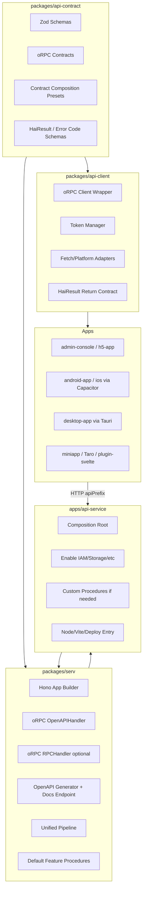

# hai-framework API-first 架构方案：oRPC + Hono + Svelte

> 目标：统一 API 契约、提升 AI 实现准确率、最大化兼容 Web / App / 小程序，同时保留 Svelte/SvelteKit 作为主要 UI 技术栈。
>
> 结论：引入 **oRPC** 作为唯一契约与类型安全 API 体系；新增 **`@h-ai/api-contract`** 作为无实现契约包，并按应用/部署按需组合契约；新增 **`@h-ai/serv`** 作为 Hono + oRPC 的服务运行时集成模块，并内置常用模块的默认 procedure 实现；升级 **`@h-ai/api-client`** 为 oRPC 客户端封装并统一返回 `HaiResult`；保留 **`@h-ai/kit`** 作为 SvelteKit 集成层，但删除其中契约相关能力。

---

## 1. 核心决策

### 1.1 统一采用 oRPC，不再自定义契约规范

后续公共 HTTP API 不再继续扩展旧自研端点模型，而是统一采用 oRPC：

- 契约定义：`@orpc/contract`
- 服务端实现：`@orpc/server` 的 `implement(contract)`
- Hono 集成：`@orpc/server/fetch` 的 `RPCHandler`，以及 `@orpc/openapi/fetch` 的 `OpenAPIHandler`
- OpenAPI 文档：`@orpc/openapi` 的 `OpenAPIGenerator`
- 客户端：`@orpc/client` + `@orpc/openapi-client/fetch`
- Schema：优先 Zod；长期可兼容 Standard Schema 生态

这样做的原因：

1. **不重复造契约轮子**：oRPC 已覆盖类型安全、契约优先、OpenAPI、fetch client、错误、流式能力。
2. **AI 更容易实现功能**：AI 只需要遵循固定套路：schema → contract → implementation → client → test。
3. **端侧兼容更好**：REST/OpenAPI 对 Web、Capacitor、Tauri、小程序、第三方客户端都更友好。
4. **实现与契约物理隔离**：客户端只依赖契约包，不可能把服务端 handler 打进 bundle。

### 1.2 对外 API 优先使用 OpenAPIHandler，RPCHandler 默认关闭

oRPC 有两种重要 handler：

| Handler          | 路径建议              | 用途                                            | 是否对外主推 |
| ---------------- | --------------------- | ----------------------------------------------- | ------------ |
| `OpenAPIHandler` | `${apiPrefix}/*`      | REST/OpenAPI 风格 API，适合跨端、文档、外部调用 | 是           |
| `RPCHandler`     | `${rpcPrefix}/*` 可选 | TS 内部 RPC 风格调用，适合内部工具或调试        | 否，默认关闭 |

推荐：**公共 API 以可配置的 `${apiPrefix}` OpenAPI/REST 形式对外暴露**。例如默认值可以是 `/api/v1`，升级时可改为 `/api/v2` 或由应用配置决定。

`RPCHandler` 只适合内部 TS 调用，不应该默认暴露到公网。若确实启用，需要同时满足网络隔离、网关控制和服务端校验，详见 [5.5 路径与访问控制](#55-路径与访问控制)。

### 1.3 SvelteKit 继续保留，但退出公共 API 契约核心

SvelteKit 仍然适合：

- Web UI
- H5
- 管理后台
- SSR / SSG / SPA
- Capacitor / Tauri 静态壳

但不再作为公共 API 的唯一运行框架。后续跨端公共 API 由 Hono + oRPC 承载。

### 1.4 小程序方向

本仓库不处理小程序 UI 框架实现。小程序侧会在其他工程中考虑升级 `tarojs-plugin-svelte`。

本仓库只需要保证：

- API 契约标准化
- OpenAPI 可生成
- `api-client` 可适配 Taro / wx.request / fetch
- 小程序端不需要理解 SvelteKit 后端实现

---

## 2. 总体架构



关键依赖方向：

```text
@h-ai/api-contract  → 依赖 core + zod + @orpc/contract；只包含契约、schema、按需组合预设
@h-ai/serv          → 依赖 api-contract + hono + @orpc/server + @orpc/openapi；按 features 子路径提供默认 procedures
@h-ai/api-client    → 依赖 api-contract + @orpc/client + @orpc/openapi-client
apps/api-service    → 依赖 serv + api-contract + 已启用的 iam/ai/storage/reldb 等业务模块，只负责装配
Svelte/Taro/App     → 依赖 api-client + api-contract 类型；禁止依赖 serv 或 api-service 实现
```

### 2.1 术语与命名总则

后续文档和实现统一使用以下术语，避免 `router` / `route` 在不同层级混用：

| 名称         | 单复数 | 所属层级                                | 含义                                           | 示例                            |
| ------------ | ------ | --------------------------------------- | ---------------------------------------------- | ------------------------------- |
| `contract`   | 单数   | `@h-ai/api-contract` / `serv.createApp` | 一个已组合完成的应用级 oRPC 契约树             | `createApiContract(…)`          |
| `contracts`  | 复数   | 文档语义 / 可选目录                     | 多个领域契约的集合                             | IAM contract + Storage contract |
| `procedures` | 复数   | `@h-ai/serv` / `apps/api-service`       | 多个 oRPC procedure handler 组成的服务端实现树 | `createIamProcedures()`         |
| `http`       | 单数   | `@h-ai/serv.createApp()`                | 一个 Hono app 的 HTTP 挂载配置对象             | `http.apiPrefix`                |
| `apiPrefix`  | 单数   | HTTP 层                                 | REST/OpenAPI 对外前缀                          | `/api/v1`                       |
| `rpc`        | 单数   | HTTP 层                                 | 可选内部 RPC 入口配置                          | `/rpc`                          |

约束：

- `serv.createApp()` 参数使用 `contract`、`procedures`、`http`，不使用容易混淆的 `router`、`route`。
- `contract` 在 `createApp` 中保持单数，因为调用方传入的是一个已组合完成的应用级契约树；多个领域契约先用 `createApiContract()` 组合。
- `procedures` 使用复数，因为它是多个 procedure handler 的实现树，并且必须与 `contract` 的形状对应。
- `http` 使用单数，因为它是一个 HTTP 挂载配置对象，内部再包含 `openapi`、`docs`、`health`、`rpc` 等子配置。
- `router` 只在解释 oRPC 官方 API 或内部类型时使用，例如 `implement(contract).router(...)`。
- `route` 只指 oRPC contract 中的 `.route({ method, path })`，不作为 `serv` 配置对象名。
- 目录、文件、函数名按内容单复数命名：包含多个同类对象时用复数，例如 `schemas`、`features`、`adapters`、`presets`、`procedures`。
- 表示一个抽象子系统或生命周期概念时保持单数，例如 `app/`、`context/`、`pipeline/`、`openapi/`、`testing/`；它们不是同类对象列表，而是一组围绕同一概念的实现文件。
- 文件名使用 kebab-case；包含多个 schema 的文件使用 `*-schemas.ts`，包含一个 contract 对象的文件使用 `*-contract.ts`，包含多个 procedure handlers 的文件使用 `*-procedures.ts`。
- 函数名使用动词开头：`createXxx`、`buildXxx`、`generateXxx`；返回多个 procedure handlers 的默认模块实现统一命名为 `create<Domain>Procedures()`。

---

## 3. 为什么需要统一 `api-contract` 模块

### 3.1 问题：client 不能引用包含 handler 的 procedures

oRPC 社区示例里常见 `AppRouter` 这类命名。本仓库为了避免和 HTTP route 混淆，统一把服务端实现树称为 `procedures`。

如果只做类型导入，TypeScript 编译后会擦除，不会把服务端实现打进客户端 bundle：

```ts
import type { ApiServiceProcedures } from './procedures'
```

但在生产级 monorepo 中，仅靠约定容易误用：

```ts
// 错误：值导入可能导致 handler 实现进入客户端依赖图
import { createApiServiceProcedures } from '@h-ai/api-service/server/procedures'
```

因此推荐使用独立契约包：

```text
packages/api-contract  ← 只有 schema + contract，无 handler 实现
apps/api-service       ← 装配 procedures，不能被客户端导入
packages/api-client    ← 只导入 api-contract
```

### 3.2 直接进入最终状态：公共契约只在 `api-contract`

除 `@h-ai/kit` 继续保留 SvelteKit 集成能力外，其它模块不考虑旧契约兼容。公共 HTTP API 契约直接进入最终状态：

```text
packages/api-contract/
  src/
    index.ts
    common/
      pagination-schemas.ts
      auth-schemas.ts
      result-schemas.ts
    iam/
      iam-schemas.ts
      iam-contract.ts
      index.ts
    ai/
      ai-schemas.ts
      ai-contract.ts
      index.ts
    storage/
      storage-schemas.ts
      storage-contract.ts
      index.ts
    composition/
      create-api-contract.ts
```

最终状态要求：

- `packages/iam/src/api`、`packages/ai/src/api`、`packages/storage/src/api` 等公共 HTTP 契约目录删除。
- 业务模块只保留领域 service、provider、repository、内部 schema；不再导出公共 HTTP contract。
- 所有公共请求/响应 DTO、错误 schema、分页 schema、鉴权 metadata 都进入 `@h-ai/api-contract`。
- 所有前端和外部客户端只从 `@h-ai/api-contract` 与 `@h-ai/api-client` 获取类型和调用入口。
- 不提供旧端点对象、自研端点类型、通用端点调用函数等旧契约兼容层。

原则：

- **公共 HTTP API 契约只放 `api-contract`**。
- 业务模块可以保留内部类型、领域 schema、service API，但不再作为客户端公共 HTTP 契约入口。
- `api-contract` 不应依赖 `@h-ai/iam` / `@h-ai/ai` 等业务实现模块，避免循环依赖和客户端 bundle 污染。

### 3.3 按需组合契约，避免不使用的模块进入 API

`@h-ai/api-contract` 不应该强制导出一个“包含所有模块”的唯一 `appContract`。正确做法是：

1. 每个领域只导出自己的 contract，例如 `iamContract`、`storageContract`。
2. `api-contract` 提供一个轻量组合函数，例如 `createApiContract()`。
3. 每个应用/部署在自己的代码中组合 contract，只组合实际启用的模块。
4. `serv`、`api-client`、OpenAPI 生成都使用同一个“应用契约”。

示意：

```ts
// apps/api-service/src/app.ts
import { aiContract, createApiContract, iamContract, storageContract } from '@h-ai/api-contract'

const contract = createApiContract({
  iam: iamContract,
  storage: storageContract,
  ai: aiContract,
})
```

如果某个部署不需要 `storage`，就不要把 `storageContract` 加进去：

```ts
const contract = createApiContract({
  iam: iamContract,
})
```

这样带来的结果：

- 未组合的模块不会出现在 OpenAPI 文档。
- 未组合的模块不会出现在服务端 procedures 类型中。
- 未组合的模块不会出现在客户端调用类型中。
- 配合 `@h-ai/api-contract/iam` 等子路径导出，端侧 bundler 不需要拉入未使用模块。

可选提供 `haiFullContract` 作为开发/演示用全量预设，但生产应用不应默认使用全量预设。

### 3.4 `api-contract` 的职责

`@h-ai/api-contract` 只做以下事情：

- 定义请求/响应 schema
- 定义 oRPC contract
- 定义公共错误 schema
- 复用 `@h-ai/core` 的 `HaiResult`、`HaiError`、错误定义与错误码规则
- 定义 auth/security metadata
- 提供按需组合 contract 的工具和应用预设
- 导出 OpenAPI 生成所需的纯契约对象
- 导出前后端共享的纯类型

它不做：

- 不实现 handler
- 不连接数据库
- 不调用 `iam.auth.login`
- 不依赖 SvelteKit/Hono
- 不读取环境变量
- 不包含任何密钥或运行时状态

---

## 4. `@h-ai/api-contract` 设计

### 4.1 包定位

包名：`@h-ai/api-contract`

描述：hai-framework 公共 API 契约包，基于 oRPC + Zod 定义跨端共享 API。

建议依赖：

```json
{
  "dependencies": {
    "@h-ai/core": "workspace:*",
    "@orpc/contract": "catalog:",
    "zod": "catalog:"
  },
  "devDependencies": {
    "typescript": "catalog:",
    "vitest": "catalog:",
    "tsup": "catalog:"
  }
}
```

`api-contract` 需要依赖 `@h-ai/core`，原因是错误码、`HaiError`、`HaiResult` 是全框架统一契约的一部分，不能在 API 层另起一套结果模型。

约束：

- `api-contract` 只允许从 `@h-ai/core` 复用类型、错误定义、结果模型与纯工具。
- `api-contract` 禁止调用 `core.init()`、logger 初始化、配置加载等运行时能力。
- `api-contract` 中的响应 schema 应与 `HaiResult<T>` 结构一致，避免客户端再包一层 `safe`。

### 4.2 导出结构

```text
packages/api-contract/
  package.json
  README.md
  tsconfig.json
  tsup.config.ts
  vitest.config.ts
  src/
    index.ts
    common/
      pagination-schemas.ts
      response-schemas.ts
      result-schemas.ts
    iam/
      iam-schemas.ts
      iam-contract.ts
      index.ts
    ai/
      ai-schemas.ts
      ai-contract.ts
      index.ts
    storage/
      storage-schemas.ts
      storage-contract.ts
      index.ts
    composition/
      create-api-contract.ts
```

### 4.3 契约定义示意

```ts
// packages/api-contract/src/iam/iam-contract.ts
import { oc } from '@orpc/contract'
import {
  CurrentUserOutputSchema,
  LoginInputSchema,
  LoginOutputSchema,
  RefreshTokenInputSchema,
  RefreshTokenOutputSchema,
} from './iam-schemas.js'

export const iamContract = {
  auth: {
    login: oc
      .route({
        method: 'POST',
        path: '/auth/login',
        operationId: 'iam.auth.login',
        summary: 'Password login',
        tags: ['iam', 'auth'],
      })
      .input(LoginInputSchema)
      .output(LoginOutputSchema),

    refresh: oc
      .route({
        method: 'POST',
        path: '/auth/refresh',
        operationId: 'iam.auth.refresh',
        summary: 'Refresh access token',
        tags: ['iam', 'auth'],
      })
      .input(RefreshTokenInputSchema)
      .output(RefreshTokenOutputSchema),

    currentUser: oc
      .route({
        method: 'GET',
        path: '/auth/me',
        operationId: 'iam.auth.currentUser',
        summary: 'Get current user',
        tags: ['iam', 'auth'],
      })
      .output(CurrentUserOutputSchema),
  },
}
```

按需组合：

```ts
// apps/api-service/src/app.ts
import { aiContract, createApiContract, iamContract, storageContract } from '@h-ai/api-contract'

const contract = createApiContract({
  iam: iamContract,
  storage: storageContract,
  ai: aiContract,
})
```

### 4.4 路径规范

建议新 contract 使用 OpenAPI 风格路径参数：

```text
/iam/users/{id}
```

而不是旧的 Hono/SvelteKit 风格：

```text
/iam/users/:id
```

原因：OpenAPI 文档和 oRPC OpenAPIHandler 对 `{id}` 更自然。Hono 外层只挂载前缀，不负责逐条 REST route 匹配。

---

## 5. 新增 `@h-ai/serv` 模块

### 5.1 包定位

包名：`@h-ai/serv`

职责：hai-framework 的服务端运行时集成模块，基于 Hono + oRPC 提供统一 API 服务基础设施。

`@h-ai/serv` 类似现在的 `@h-ai/kit`，但面向独立 API 服务，而不是 SvelteKit。

它提供：

- Hono app 创建
- oRPC `OpenAPIHandler` 挂载
- 可选 oRPC `RPCHandler` 挂载
- 可启用/禁用的 OpenAPI JSON endpoint
- 可启用/禁用的 Scalar/Swagger 风格 API 文档 endpoint
- 请求上下文构建
- 统一请求/过程 pipeline（Hono middleware + oRPC procedure middleware + handler lifecycle hook）
- IAM、Storage、AI 等常用模块的默认 procedures 实现
- Node 启动/关闭辅助
- 测试辅助

它不应该承载所有业务逻辑。默认 procedures 只是很薄的适配层：把 oRPC procedure 绑定到对应模块 service。业务规则仍在 `@h-ai/iam`、`@h-ai/storage`、`@h-ai/ai` 等模块内。

`apps/api-service` 默认只做装配：启用哪些 contract、初始化哪些模块、选择哪些默认 procedures。只有默认 procedures 不满足应用定制需求时，才在应用内写自定义 procedures。

### 5.2 推荐依赖

```json
{
  "dependencies": {
    "@h-ai/api-contract": "workspace:*",
    "@h-ai/core": "workspace:*",
    "@orpc/server": "catalog:",
    "@orpc/openapi": "catalog:",
    "@orpc/zod": "catalog:",
    "hono": "catalog:",
    "zod": "catalog:"
  }
}
```

> 需要在根 `pnpm-workspace` catalog 中补充 oRPC/Hono 依赖版本。实际实施时应以当前 oRPC 文档最新版本为准。

默认 feature procedures 需要对应业务模块时，使用 `features` 子路径导出与可选依赖约束：

```text
@h-ai/serv/features/iam      → 需要 @h-ai/iam
@h-ai/serv/features/storage  → 需要 @h-ai/storage
@h-ai/serv/features/ai       → 需要 @h-ai/ai
```

根入口 `@h-ai/serv` 不应直接导入所有业务模块，避免启用 IAM 时把 Storage/AI 的实现也拉进依赖图。

### 5.3 目录结构

```text
packages/serv/
  package.json
  README.md
  tsconfig.json
  tsup.config.ts
  vitest.config.ts
  src/
    index.ts
    serv-main.ts
    serv-types.ts
    app/
      create-app.ts
      http-config.ts
      mount-orpc.ts
      health.ts
    context/
      context-types.ts
      create-context.ts
    features/
      iam-procedures.ts
      storage-procedures.ts
      ai-procedures.ts
    pipeline/
      hono.ts
      orpc.ts
      handler.ts
      internal-rpc.ts
    openapi/
      generate-openapi.ts
      docs-page.ts
    adapters/
      node.ts
      fetch.ts
    testing/
      create-test-app.ts
```

### 5.4 `serv` 暴露的核心 API

```ts
export const serv = {
  createApp,
  createContext,
  pipeline,
  openapi: {
    generateSpec,
    createDocsPage,
  },
  adapters: {
    node,
    fetch,
  },
}
```

各项职责：

| API                                                  | 做什么                                                                                   | 什么时候用                                       |
| ---------------------------------------------------- | ---------------------------------------------------------------------------------------- | ------------------------------------------------ |
| `serv.createApp(options)`                            | 创建 Hono app，挂载 OpenAPIHandler、可选 RPCHandler、health、OpenAPI JSON、docs endpoint | API 服务入口默认只调用它                         |
| `serv.createContext(input)`                          | 从 `Request` 构建 `ServContext`：requestId、accessToken、IP、locale 等                   | `createApp()` 默认使用；应用需要扩展上下文时复用 |
| `serv.requireAuth / requirePermission / mapHaiError` | oRPC procedure 包装器：认证、授权、统一异常转换                                          | 在应用自定义 procedure 时使用                    |
| `serv.securityHeaders() / requireInternalRPC()`      | Hono 中间件：安全响应头、内部 RPC 访问控制                                               | 内部 RPC 仅 loopback/内网/允许列表访问           |
| `serv.generateSpec(contract, options)`               | 根据应用级 `contract` 生成 OpenAPI spec                                                  | 构建 `/openapi.json`、CI 校验、离线导出文档      |
| `serv.createDocsPage(spec, options)`                 | 根据 OpenAPI spec 创建 Scalar/Swagger 文档页面                                           | 启用 `http.docs` 时使用                          |
| `serv.listen(app, options)`                          | Node 服务启动（默认 host `127.0.0.1`，支持 `0.0.0.0` 或指定 IP）/ 关闭                   | `apps/api-service` 本地开发、Node 部署           |
| `serv.toFetch(app)`                                  | 把 Hono app 包装为标准 `fetch(Request)` handler                                          | Workers、Bun、Deno、测试或其它 fetch runtime     |

`createApp()` 的三个核心参数：

| 参数         | 单复数 | 用途                                            | 为什么需要                                                                                                           |
| ------------ | ------ | ----------------------------------------------- | -------------------------------------------------------------------------------------------------------------------- |
| `contract`   | 单数   | 一个已组合完成的应用级 oRPC contract            | 用于生成 OpenAPI、校验文档范围、约束客户端/服务端形状；虽然内部有很多 endpoints，但对 `createApp()` 来说它是一个整体 |
| `procedures` | 复数   | 与 `contract` 形状对应的多个 procedure handlers | 真正处理请求；可由 `@h-ai/serv/features/*` 默认实现和应用自定义实现组合                                              |
| `http`       | 单数   | 一个 Hono app 的 HTTP 挂载配置                  | 控制 `apiPrefix`、OpenAPI/docs endpoint、health、RPC 内部入口等 HTTP 层行为                                          |

`contract` 不直接处理请求，`procedures` 才处理请求；`contract` 的价值是让 API 服务可生成文档、可被 typed client 消费、可测试“启用了哪些 API”。即使 `http.openapi` 和 `http.docs` 关闭，`contract` 仍用于保持服务端实现与客户端类型来源一致。

默认模块 procedures 通过子路径导入，避免根入口过重：

```ts
import { createIamProcedures } from '@h-ai/serv/features/iam'
import { createStorageProcedures } from '@h-ai/serv/features/storage'
```

### 5.5 路径与访问控制

所有路径都必须可配置，不能把 `v1` 写死在模块内部：

```ts
export interface CreateServAppOptions<TContract, TProcedures> {
  contract: TContract
  procedures: TProcedures
  http?: Partial<ServHttpConfig>
}

export interface ServHttpConfig {
  apiPrefix: `/api/${string}`
  openapi?: false | { path: string }
  docs?: false | { path: string, requireAuth?: boolean }
  health?: false | { path: string, readyPath?: string }
  rpc?: false | {
    prefix: string
    access: 'loopback' | 'private-network' | 'gateway-only'
  }
}
```

推荐默认值：

```text
apiPrefix: /api/v1
health:    { path: /health, readyPath: /ready }
openapi:   false
docs:      false
rpc:       false
```

OpenAPI JSON 和文档页面是可选 endpoint。开发环境可以启用，生产环境可以关闭或加权限：

```ts
serv.createApp({
  contract,
  procedures,
  http: {
    apiPrefix: '/api/v1',
    openapi: { path: '/openapi.json' },
    docs: { path: '/docs', requireAuth: true },
  },
})
```

版本升级时只调整应用配置：

```ts
serv.createApp({
  contract,
  procedures,
  http: {
    apiPrefix: '/api/v2',
  },
})
```

`/rpc/*` 内部访问控制原则：

1. **默认关闭**：生产环境不启用 `RPCHandler`，只启用 `OpenAPIHandler`。
2. **网络优先**：如果启用 RPC，应优先通过内网监听、私有子网、服务网格或 API 网关限制，不把 RPC 路由暴露到公网。
3. **网关兜底**：公网网关不转发 `${rpcPrefix}`；内部网关可按 mTLS、内网来源、服务身份放行。
4. **服务端再校验**：Hono 层仍需做来源 IP、转发头、内部身份凭证校验，防止网关配置失误。
5. **无浏览器跨域**：RPC 路径不配置 CORS，不允许浏览器 App 直接访问。
6. **可审计**：所有 RPC 请求必须记录 requestId、调用方、procedure path、耗时和结果，敏感字段脱敏。

Hono 挂载示意：

```ts
const resolvedHttp = resolveServHttpConfig(options.http)

const openAPIHandler = new OpenAPIHandler(procedures, {
  interceptors: [
    onError((error) => {
      logger.error('oRPC handler failed', sanitizeORPCError(error))
    }),
  ],
})

app.use(`${resolvedHttp.apiPrefix}/*`, async (c, next) => {
  const context = await createContext(c)
  const { matched, response } = await openAPIHandler.handle(c.req.raw, {
    prefix: resolvedHttp.apiPrefix,
    context,
  })

  if (matched) {
    return c.newResponse(response.body, response)
  }

  await next()
})
```

可选 RPC 挂载必须先过内部访问控制：

```ts
if (resolvedHttp.rpc !== false) {
  app.use(`${resolvedHttp.rpc.prefix}/*`, pipeline.hono.requireInternalRPC(resolvedHttp.rpc))
  app.use(`${resolvedHttp.rpc.prefix}/*`, mountRPCHandler(rpcHandler, resolvedHttp.rpc.prefix))
}
```

### 5.6 统一 pipeline：概念区分，目录合并

Hono、oRPC 和 handler interceptor 是不同层级，不能在概念上混为一谈；但在 `@h-ai/serv` 的文件组织上可以统一放到 `pipeline/` 目录中。

| 层级                      | 触发时机                      | 适合放什么                                                                 | 不适合放什么            |
| ------------------------- | ----------------------------- | -------------------------------------------------------------------------- | ----------------------- |
| Hono middleware           | HTTP 请求进入 oRPC handler 前 | CORS、安全头、requestId、bodyLimit、rateLimit、内部 RPC 访问控制、基础日志 | 具体 procedure 权限判断 |
| oRPC procedure middleware | 已匹配到具体 procedure 后     | `requireAuth`、`requirePermission`、输入相关权限、审计、领域错误映射       | CORS、网关/IP 策略      |
| oRPC handler interceptor  | handler 生命周期外层          | 统一错误日志、trace、指标、成功/失败统计                                   | 业务授权规则            |

`pipeline/` 建议导出：

```ts
export const pipeline = {
  hono: {
    requestId,
    cors,
    securityHeaders,
    bodyLimit,
    rateLimit,
    requireInternalRPC,
  },
  orpc: {
    requireAuth,
    requirePermission,
    mapHaiError,
    audit,
  },
  handler: {
    onError,
    onSuccess,
    onFinish,
    trace,
  },
}
```

### 5.7 `ServContext`

建议统一请求上下文：

```ts
export interface ServContext {
  requestId: string
  locale: string
  ip?: string
  userAgent?: string
  accessToken?: string
  session?: {
    userId: string
    username?: string
    roles: string[]
    permissions: string[]
  }
  logger: LoggerLike
}
```

业务实现可以在 `apps/api-service` 里通过闭包注入模块实例，而不是把所有模块实例塞进 `ServContext`。

### 5.8 默认 feature procedures

为了避免 `apps/api-service`、后台服务、边缘服务等应用重复实现相同的 IAM、Storage、AI API 绑定，`@h-ai/serv` 提供默认 feature procedures。

默认 procedures 的规则：

- 只负责把 oRPC contract 绑定到对应模块 service，不写领域业务逻辑。
- 只通过子路径导出，应用启用哪个模块就导入哪个模块。
- 依赖由应用显式提供，`serv` 不在内部初始化业务模块。
- 返回值直接沿用业务模块的 `HaiResult<T>`。
- 可被应用替换；一旦需要定制行为，应用可以只覆盖某个 domain 的 procedures。

示意：

```ts
import { createIamProcedures } from '@h-ai/serv/features/iam'
import { createStorageProcedures } from '@h-ai/serv/features/storage'

const procedures = {
  iam: createIamProcedures({ iam }),
  storage: createStorageProcedures({ storage }),
}
```

命名约定：

| 模块    | contract          | 默认 procedure factory      | 子路径                        |
| ------- | ----------------- | --------------------------- | ----------------------------- |
| IAM     | `iamContract`     | `createIamProcedures()`     | `@h-ai/serv/features/iam`     |
| Storage | `storageContract` | `createStorageProcedures()` | `@h-ai/serv/features/storage` |
| AI      | `aiContract`      | `createAiProcedures()`      | `@h-ai/serv/features/ai`      |

默认 procedures 不进入 `@h-ai/api-contract`，因为 contract 包必须保持无实现、无运行时状态。

---

## 6. `apps/api-service` 的新定位

`apps/api-service` 从 SvelteKit API app 迁移为 Hono API service 的组合根。

它负责：

- 初始化 `core/reldb/iam/ai/cache/storage` 等模块
- 选择启用哪些 contract preset 与默认 feature procedures
- 必要时为应用差异实现少量自定义 procedures
- 调用 `@h-ai/serv.createApp()` 挂载 handler、docs、pipeline
- 提供本地 dev/preview/build/deploy 入口

建议结构：

```text
apps/api-service/
  package.json
  README.md
  vite.config.ts 或 tsup.config.ts
  src/
    index.ts              # Node 启动入口
    app.ts                # createApiServiceApp()
    server/
      init.ts             # 初始化 hai 模块
      close.ts            # 关闭资源
      context.ts          # 构建 ServContext 扩展
      procedures/
        index.ts          # 组合默认或自定义 procedures
        billing-procedures.ts # 示例：应用自定义 procedures
      errors.ts           # 应用级错误映射，能复用 serv 时不新增
  tests/
    iam-api.test.ts
    openapi.test.ts
```

`apps/api-service/src/server/procedures/index.ts` 推荐保持很薄：

```ts
import { createIamProcedures } from '@h-ai/serv/features/iam'
import { createStorageProcedures } from '@h-ai/serv/features/storage'

export function createApiServiceProcedures(deps: ApiServiceDeps) {
  return {
    iam: createIamProcedures({ iam: deps.iam }),
    storage: createStorageProcedures({ storage: deps.storage }),
  }
}
```

`apps/api-service` 不再需要 SvelteKit 的：

- `svelte.config.js`
- `src/hooks.server.ts`
- `src/routes/**/+server.ts`

实施完成后必须删除这些 SvelteKit API 入口，目标是 Hono app 独立运行。

---

## 7. `@h-ai/kit` 处理方案

### 7.1 保留 kit，但删除契约相关能力

`@h-ai/kit` 继续作为 SvelteKit 集成层，保留：

- `kit.createHandle`
- `kit.sequence`
- `kit.handler`
- `kit.response`
- `kit.validate`
- `kit.guard`
- `kit.auth`
- `kit.client`（如仍服务 SvelteKit 同源请求）
- `kit.adapter`
- `kit.a2a`（若仍与 SvelteKit hooks 相关）

删除或迁出：

- 旧自研端点类型与端点定义辅助函数
- SvelteKit 旧契约绑定辅助函数
- `packages/kit/src/kit-contract.ts`
- README / Skill 中“契约模式”相关说明

### 7.2 需要修改的 kit 文件

实施时应处理：

```text
packages/kit/src/kit-contract.ts              # 删除
packages/kit/src/kit-main.ts                  # 删除旧契约绑定 import/export
packages/kit/src/index.ts                     # 删除旧端点类型/定义辅助 export
packages/kit/README.md                        # 删除或改写契约章节
packages/cli/templates/skills/hai-kit/SKILL.md # 删除旧契约用法
packages/kit/tests/**                         # 删除或迁移契约相关测试
```

如果需要在 SvelteKit 内部调用公共 API：

- SSR 页面：使用 `@h-ai/api-client` 的 SSR/fetch 适配。
- 同进程服务端：优先直接调用业务模块 service，避免 HTTP 自环。
- 公共 API：只通过 `@h-ai/serv` 暴露。

---

## 8. `@h-ai/api-client` 升级方案

### 8.1 新定位

`@h-ai/api-client` 从“自研端点 HTTP 客户端”升级为“oRPC/OpenAPI 客户端封装 + `HaiResult` 统一返回 + Token 管理 + 跨端 fetch 适配”。

它负责：

- 根据按需组合的 contract 创建 typed client。
- 注入 baseUrl、Authorization header、requestId、clientName。
- 401 自动刷新与并发去重。
- 平台 TokenStorage。
- request/response pipeline。
- 将网络错误、协议错误、oRPC 错误统一转换为 `HaiResult`。
- 支持 streaming/SSE（后续）。

### 8.2 推荐 API 形态

因为 `@h-ai/api-contract` 已经复用 `@h-ai/core` 的 `HaiResult` 和错误体系，推荐 API 可以简化为一层：

```ts
import { createApiClient } from '@h-ai/api-client'
import { aiContract, createApiContract, iamContract, storageContract } from '@h-ai/api-contract'

export const api = createApiClient(
  createApiContract({ iam: iamContract, storage: storageContract, ai: aiContract }),
)

await api.init({
  baseUrl: 'https://api.example.com/api/v1',
  auth: { refreshPath: '/auth/refresh' },
})

const result = await api.iam.auth.login({
  identifier: 'alice',
  password: 'xxx',
})

if (!result.success) {
  return result
}
```

约定：

- `api.<domain>.<resource>.<operation>()` 直接返回 `Promise<HaiResult<T>>`。
- 不再推荐 `api.safe` / `api.client` 双入口。
- 不再保留旧的“端点对象 + 通用调用函数”形态。
- 如果某个应用只组合 `iamContract`，客户端类型中就只有 `api.iam.*`。

### 8.3 内部实现

```ts
import type { ContractRouterClient } from '@orpc/contract'
import type { JsonifiedClient } from '@orpc/openapi-client'
import { err } from '@h-ai/core'
import { createORPCClient } from '@orpc/client'
import { OpenAPILink } from '@orpc/openapi-client/fetch'

export function createApiClient<const TContract extends Record<string, unknown>>(contract: TContract) {
  const state = createApiClientState()

  const link = new OpenAPILink(contract, {
    url: state.config.baseUrl,
    headers: async () => ({
      'authorization': await state.token.getAuthorizationHeader(),
      'x-request-client': state.config.clientName ?? 'hai-api-client',
    }),
    fetch: state.fetch,
  })

  const rawClient: JsonifiedClient<ContractRouterClient<TContract>> = createORPCClient(link)

  return wrapClientWithHaiResult(rawClient, {
    onError: error => err(mapORPCClientError(error)),
  })
}
```

### 8.4 Token 与平台适配

继续保留 `TokenStorage` 概念，并扩展：

| 平台          | Storage                                                 |
| ------------- | ------------------------------------------------------- |
| Browser H5    | `localStorage` 仅作为默认；敏感场景优先 httpOnly cookie |
| SvelteKit SSR | request-scoped memory/cookie adapter                    |
| Capacitor     | `@h-ai/capacitor` secure/preferences adapter            |
| Tauri         | Tauri secure store adapter（后续新增）                  |
| 小程序/Taro   | `Taro.getStorage` / `Taro.setStorage` adapter           |
| 原生 wx       | `wx.getStorage` / `wx.setStorage` adapter               |
| Tests         | memory adapter                                          |

### 8.5 fetch 适配

`api-client` 不应强绑定浏览器 `fetch`。保持一个最小扩展点即可：传入 fetch-compatible 函数。

```ts
export interface ApiClientConfig {
  fetch?: typeof globalThis.fetch
}
```

Taro/wx 可通过包装 `Taro.request` / `wx.request` 模拟 fetch 的 `Request/Response` 语义；不再额外设计一套 request adapter 接口，避免调用链过长。

### 8.6 删除旧调用模型

旧模型直接删除，不保留兼容：

```ts
// 删除
await legacyEndpointCall(input)

// 保留唯一推荐形态
await api.iam.auth.login(input)
```

实施要求：

- 旧端点类型、端点定义辅助函数、通用调用器删除。
- `@h-ai/api-client` README 只保留 `createApiClient(contract)` 用法。
- 所有 App 内手写 fetch 公共 API 的地方改为 typed client。

---

## 9. oRPC + Hono + Client 集成全链路

### 9.1 契约包：只有契约，无实现

```ts
// apps/api-service/src/app.ts
import { aiContract, createApiContract, iamContract, storageContract } from '@h-ai/api-contract'

const contract = createApiContract({
  iam: iamContract,
  storage: storageContract,
  ai: aiContract,
})
```

### 9.2 服务端：选择默认 procedures

```ts
// apps/api-service/src/server/procedures/index.ts
import { createIamProcedures } from '@h-ai/serv/features/iam'

export function createApiServiceProcedures(deps: ApiServiceDeps) {
  return {
    iam: createIamProcedures({ iam: deps.iam }),
  }
}
```

如果默认 procedures 不满足需求，应用可以只覆盖对应 domain：

```ts
const procedures = {
  ...createApiServiceProcedures(deps),
  iam: createCustomIamProcedures({ iam, audit: deps.audit }),
}
```

### 9.3 API service：组合 procedures 并挂载 Hono

```ts
const procedures = createApiServiceProcedures({ iam })

const app = serv.createApp({
  contract,
  procedures,
  http: {
    apiPrefix: '/api/v1',
    openapi: { path: '/openapi.json' },
    docs: { path: '/docs', requireAuth: true },
    rpc: false,
  },
})
```

### 9.4 客户端：只引用契约，不引用实现

```ts
// @h-ai/api-client
import { createApiClient } from '@h-ai/api-client'
import { aiContract, createApiContract, iamContract, storageContract } from '@h-ai/api-contract'

export const api = createApiClient(
  createApiContract({ iam: iamContract, storage: storageContract, ai: aiContract }),
)
```

客户端应用只使用：

```ts
import { api } from '@h-ai/api-client'

await api.iam.auth.login(input)
```

禁止：

```ts
import { createIamProcedures } from '@h-ai/serv/features/iam'
import { createApiServiceProcedures } from 'apps/api-service/src/server/procedures/index'
```

### 9.5 防止实现泄露的规则

必须建立以下边界：

1. `@h-ai/api-contract` 不导出 handler。
2. `@h-ai/api-client` 只依赖 `@h-ai/api-contract` 和 oRPC client 运行时。
3. 前端 apps 禁止导入 `@h-ai/serv`、`@h-ai/serv/features/*` 和 `apps/api-service/src/server/**`。
4. 如果需要引用服务端 procedures 类型，只能 `import type`，且优先从 contract 推导客户端类型。
5. ESLint / dependency rules 后续应禁止 client 层值导入 server 层。

### 9.6 自定义契约与 procedures

除了 IAM、Storage、AI 这类 `@h-ai/serv/features/*` 内置默认 procedures，应用也可以新增自定义公共 API。原则是：**公共契约仍然放在 `@h-ai/api-contract`，服务端实现按复用范围选择放在 `@h-ai/serv` 或应用内。**

放置规则：

| 内容                  | 放哪里                                                    | 命名                                  |
| --------------------- | --------------------------------------------------------- | ------------------------------------- |
| 请求/响应 schemas     | `packages/api-contract/src/<domain>/<domain>-schemas.ts`  | 复数，因为通常包含多个 Zod schema     |
| oRPC contract         | `packages/api-contract/src/<domain>/<domain>-contract.ts` | 单数，因为导出一个领域 contract 对象  |
| 应用 contract 组合    | `apps/<app>/src/app.ts`                                   | 应用自己组合，不在库中预设            |
| 可复用默认 procedures | `packages/serv/src/features/<domain>-procedures.ts`       | 复数，因为实现多个 procedure handlers |
| 应用私有 procedures   | `apps/<app>/src/server/procedures/<domain>-procedures.ts` | 复数，因为实现多个 procedure handlers |

以 `billing` 为例：

```text
packages/api-contract/src/billing/billing-schemas.ts
packages/api-contract/src/billing/billing-contract.ts
apps/api-service/src/app.ts                             ← 在应用中组合 contract
apps/api-service/src/server/procedures/billing-procedures.ts
apps/api-service/src/server/procedures/index.ts
```

第一步：定义 schemas。

```ts
// packages/api-contract/src/billing/billing-schemas.ts
import { z } from 'zod'
import { haiResultSchema } from '../common/result-schemas.js'

export const BillingInvoiceSchema = z.object({
  id: z.string(),
  amount: z.number(),
})

export const ListInvoicesInputSchema = z.object({
  page: z.number().int().min(1).default(1),
})

export const ListInvoicesOutputSchema = haiResultSchema(
  z.object({
    items: z.array(BillingInvoiceSchema),
  }),
)
```

第二步：定义 contract。

```ts
// packages/api-contract/src/billing/billing-contract.ts
import { oc } from '@orpc/contract'
import { ListInvoicesInputSchema, ListInvoicesOutputSchema } from './billing-schemas.js'

export const billingContract = {
  invoices: {
    list: oc
      .route({
        method: 'GET',
        path: '/billing/invoices',
        operationId: 'billing.invoices.list',
        summary: 'List invoices',
        tags: ['billing'],
      })
      .input(ListInvoicesInputSchema)
      .output(ListInvoicesOutputSchema),
  },
}
```

第三步：在应用中组合 contract。

```ts
import { createApiContract, iamContract } from '@h-ai/api-contract'
// apps/api-service/src/app.ts
import { billingContract } from '@h-ai/api-contract/billing'

const contract = createApiContract({
  iam: iamContract,
  billing: billingContract,
})
```

第四步：实现 procedures。若 `billing` 只服务 `api-service`，放在应用内；若多个应用都复用，再上移到 `packages/serv/src/features/billing-procedures.ts` 并通过 `@h-ai/serv/features/billing` 导出。

```ts
// apps/api-service/src/server/procedures/billing-procedures.ts
import type { HaiResult } from '@h-ai/core'
import type { ServContext } from '@h-ai/serv'
import { billingContract } from '@h-ai/api-contract/billing'
import { pipeline } from '@h-ai/serv'
import { implement } from '@orpc/server'

export interface BillingProcedureDeps {
  billing: {
    invoices: {
      list: (input: unknown) => Promise<HaiResult<unknown>>
    }
  }
}

export function createBillingProcedures(deps: BillingProcedureDeps) {
  return implement(billingContract)
    .$context<ServContext>()
    .router({
      invoices: {
        list: pipeline.orpc.requirePermission('billing.invoice.read', async ({ input }) => {
          return deps.billing.invoices.list(input)
        }),
      },
    })
}
```

第五步：在应用 procedures 入口组合。

```ts
// apps/api-service/src/server/procedures/index.ts
import { createIamProcedures } from '@h-ai/serv/features/iam'
import { createBillingProcedures } from './billing-procedures.js'

export function createApiServiceProcedures(deps: ApiServiceDeps) {
  return {
    iam: createIamProcedures({ iam: deps.iam }),
    billing: createBillingProcedures({ billing: deps.billing }),
  }
}
```

验收要求：

- `api.billing.invoices.list()` 在客户端类型中可见。
- 未把 `billingContract` 加入应用 contract 组合的应用，客户端和 OpenAPI 都不出现 billing API。
- 测试覆盖 schemas、procedures、api-service 装配、OpenAPI endpoint 启用/禁用、客户端调用。

---

## 10. IAM 试点迁移方案

IAM 是最适合的第一阶段试点，因为它覆盖登录、刷新、鉴权、权限、错误、Token 存储、App 端调用等关键链路。

本试点不保留旧 HTTP 契约兼容层，直接切到最终状态。

### 10.1 最终文件布局

```text
packages/api-contract/src/iam/iam-schemas.ts
packages/api-contract/src/iam/iam-contract.ts
apps/api-service/src/app.ts                   ← 组合 contract
packages/serv/src/features/iam-procedures.ts
apps/api-service/src/server/procedures/index.ts
packages/api-client/src/api-client-types.ts
packages/api-client/src/api-client-auth.ts
packages/api-client/src/api-client-main.ts
```

删除：

```text
packages/iam/src/api/iam-api-schemas.ts
packages/iam/src/api/iam-api-contract.ts
packages/api-client/src/api-client-contract.ts
```

### 10.2 IAM contract

认证闭环：

```text
POST /auth/login
POST /auth/refresh
GET  /auth/me
POST /auth/logout
```

管理接口：

```text
GET    /iam/users
GET    /iam/users/{id}
POST   /iam/users
PUT    /iam/users/{id}
DELETE /iam/users/{id}
POST   /iam/users/{id}/reset-password
GET    /iam/roles
POST   /iam/roles
...
```

约束：

- 所有输出统一为 `HaiResult<T>` 对应 schema。
- 所有错误码复用 `@h-ai/core` 错误定义规则。
- 密码、token 等敏感字段只出现在必要输入/输出中，日志中必须脱敏。
- IAM 内部领域模型、Repository 行结构、内部 service 类型不进入 contract。

### 10.3 IAM 默认 procedures implementation

新增：

```text
packages/serv/src/features/iam-procedures.ts
```

职责：

- `implement(iamContract)`。
- procedure handler 内只调用 `iam.auth.*`、`iam.user.*`、`iam.role.*`。
- 成功直接返回业务模块的 `HaiResult<T>`。
- 未捕获异常转换为 `err(...)` 或统一 `ORPCError` 后由 `api-client` 映射为 `HaiResult`。
- 使用 `pipeline.orpc.requireAuth` / `pipeline.orpc.requirePermission` 做 procedure 级权限。
- 不在 procedure handler 中写数据库逻辑。
- `apps/api-service` 默认只调用 `createIamProcedures({ iam })`，不重复实现 IAM 适配。

示意：

```ts
export function createIamProcedures(deps: { iam: typeof iam }) {
  return implement(iamContract)
    .$context<ServContext>()
    .router({
      auth: {
        login: async ({ input }) => deps.iam.auth.login(input),
        refresh: async ({ input }) => deps.iam.auth.refreshToken(input),
        currentUser: pipeline.orpc.requireAuth(async ({ context }) => {
          return deps.iam.auth.getCurrentUser(context.session.userId)
        }),
        logout: pipeline.orpc.requireAuth(async ({ input }) => deps.iam.auth.logout(input)),
      },
    })
}
```

### 10.4 客户端调用

唯一推荐形态：

```ts
const result = await api.iam.auth.login({ identifier, password })

if (result.success) {
  await api.auth.setTokens(result.data.tokens)
}
```

必须删除旧契约调用形态：

```ts
legacyEndpointCall(input)
legacyAuthEndpoint
legacyContractBinding(handler)
```

### 10.5 IAM 测试

| 测试                      | 位置                                               | 覆盖                                                     |
| ------------------------- | -------------------------------------------------- | -------------------------------------------------------- |
| contract schema test      | `packages/api-contract/tests/iam-contract.test.ts` | schema 输入输出、路径、operationId、`HaiResult` 结构     |
| serv IAM procedures test  | `packages/serv/tests/iam-procedures.test.ts`       | 默认 procedures 调用 IAM service、鉴权、错误映射         |
| api-service assembly test | `apps/api-service/tests/iam-api.test.ts`           | Hono `app.request` 登录/刷新/me/logout                   |
| rpc access test           | `packages/serv/tests/internal-rpc.test.ts`         | RPC 默认关闭、内网/网关策略、无 CORS                     |
| api-client test           | `packages/api-client/tests/orpc-client.test.ts`    | token 注入、401 refresh、错误转 `HaiResult`              |
| IAM regression test       | `packages/iam/tests/**`                            | IAM 业务模块自身行为不变                                 |
| OpenAPI test              | `apps/api-service/tests/openapi.test.ts`           | 启用 OpenAPI endpoint 后只包含组合进预设的 IAM endpoints |

### 10.6 IAM 迁移验收标准

- `POST ${apiPrefix}/auth/login` 可用。
- `POST ${apiPrefix}/auth/refresh` 可用。
- `GET ${apiPrefix}/auth/me` 可根据 Bearer token 返回当前用户。
- `api.iam.auth.login()` 类型正确且返回 `HaiResult`。
- 启用 `http.openapi` 后，`/openapi.json` 包含 IAM endpoints 和 security scheme。
- 启用 `http.docs` 后，`/docs` 可查看 IAM API，生产环境可关闭或加权限。
- `android-app` 可通过新客户端完成登录。
- 仓库中不存在旧端点对象、旧端点类型、旧 SvelteKit 契约绑定的公共 API 使用点。

---

## 11. OpenAPI 文档方案

`@h-ai/serv` 提供统一 OpenAPI 生成能力，但查询 endpoint 必须由应用显式启用：

```ts
serv.createApp({
  contract,
  procedures,
  http: {
    apiPrefix: '/api/v1',
    openapi: { path: '/openapi.json' },
    docs: { path: '/docs', requireAuth: true },
  },
})
```

关闭方式统一使用 `false`，不再额外设计 `enabled` 字段：

```ts
serv.createApp({
  contract,
  procedures,
  http: {
    apiPrefix: '/api/v1',
    openapi: false,
    docs: false,
  },
})
```

OpenAPI 生成：

```ts
const generator = new OpenAPIGenerator({
  schemaConverters: [new ZodToJsonSchemaConverter()],
})

const spec = await generator.generate(contract, {
  info: {
    title: 'hai-framework API',
    version,
  },
  servers: [{ url: apiPrefix }],
  security: [{ bearerAuth: [] }],
  components: {
    securitySchemes: {
      bearerAuth: {
        type: 'http',
        scheme: 'bearer',
      },
    },
  },
})
```

文档 UI：

- 优先 Scalar API Reference。
- 可通过 CDN 或本地静态资源提供。
- 生产环境默认建议关闭；需要线上查看时必须加鉴权或只允许内网访问。

---

## 12. AI 友好的开发规范

新增一个 API 功能时，固定修改以下位置：

```text
packages/api-contract/src/<domain>/<domain>-schemas.ts
packages/api-contract/src/<domain>/<domain>-contract.ts
packages/serv/src/features/<domain>-procedures.ts                 # 多应用复用时
apps/api-service/src/server/procedures/<domain>-procedures.ts     # 应用私有时
apps/api-service/src/server/procedures/index.ts
packages/api-client/tests/<domain>-client.test.ts
apps/api-service/tests/<domain>-api.test.ts
```

AI 实现提示模板：

1. 先在 `api-contract` 增加输入/输出 schema。
2. 再在 contract 中增加 route，必须包含 `operationId`、`summary`、`tags`。
3. 判断 procedures 复用范围：多应用复用放 `packages/serv/src/features/<domain>-procedures.ts`；应用私有放 `apps/api-service/src/server/procedures/<domain>-procedures.ts`。
4. 在 `apps/api-service/src/server/procedures/index.ts` 组合默认和自定义 procedures。
5. 业务失败直接返回 `HaiResult`，未捕获异常统一转换为框架错误。
6. 前端只调用 `api.<domain>.<method>`。
7. 添加 contract、serv procedures、api-service 装配、client 测试。
8. 更新 README / Skill 模板。

禁止：

- 在 contract 中写 handler。
- 前端导入 `apps/api-service` 或 `@h-ai/serv`。
- 在 API procedure handler 中直接写 SQL。
- 在 UI 层直接拼 fetch URL。
- 在日志中输出 token/password/apiKey。

### 12.1 文档同步要求

每次新增或修改公共 API，必须同步更新：

| 文档                                        | 必须更新的内容                                                                                         |
| ------------------------------------------- | ------------------------------------------------------------------------------------------------------ |
| `packages/api-contract/README.md`           | 契约用途、按需组合、子路径导出、示例                                                                   |
| `packages/serv/README.md`                   | `contract/procedures/http`、默认 feature procedures、pipeline、RPC 内部访问控制、OpenAPI endpoint 开关 |
| `packages/api-client/README.md`             | `createApiClient(contract)`、TokenStorage、跨端适配、错误处理                                          |
| `packages/kit/README.md`                    | 说明 kit 不再提供公共契约能力                                                                          |
| `apps/api-service/README.md`                | 服务启动、API 前缀、OpenAPI 文档、环境配置                                                             |
| `packages/cli/templates/skills/**/SKILL.md` | AI 使用步骤、文件位置、测试要求                                                                        |

### 12.2 注释与文案规范

- 代码注释统一中文，解释“为什么这样做”，不要重复代码表面含义。
- 日志文本、`package.json` 字段、OpenAPI `summary`/`description` 优先英文，便于外部集成。
- 用户可见 UI 文案必须使用 i18n key。
- 错误码和错误消息复用 `@h-ai/core` 错误定义，不在业务模块临时拼字符串。
- 日志上下文中的 token、password、apiKey、cookie、authorization header 必须脱敏。

### 12.3 测试完整性要求

公共 API 相关改动必须覆盖：

1. Contract schema 测试：输入、输出、`HaiResult`、错误码、路径、operationId。
2. Serv procedures 测试：默认 procedures 覆盖成功、失败、鉴权、权限、错误映射。
3. API service 装配测试：Hono `app.request` 验证启用的 contract/procedures/http 配置可用。
4. Client 测试：Authorization 注入、refresh 并发去重、网络错误转 `HaiResult`。
5. OpenAPI 测试：endpoint 可启用/禁用，生成的 spec 只包含按需组合的 contract。
6. RPC 内部访问测试：默认关闭、无 CORS、网关/内网策略生效。
7. E2E 测试：至少覆盖登录 → 获取当前用户 → 退出登录。
8. 引用复核：用搜索确认不存在旧端点模型相关使用点。

---

## 13. 最终状态落地清单

本方案不做旧契约兼容迁移。实施时按最终状态一次性完成以下清单。

### 13.1 新增

- 新增 `packages/api-contract`，依赖 `@h-ai/core`、`@orpc/contract`、`zod`。
- 新增 `packages/serv`，依赖 Hono、oRPC server/openapi、`@h-ai/api-contract`。
- 在 `packages/serv/src/features/` 新增常用模块默认 procedures，例如 `iam-procedures.ts`、`storage-procedures.ts`、`ai-procedures.ts`。
- 新增 `createApiContract()` 按需组合工具；应用在自己代码中定义 contract。
- 新增 `createApiClient(contract)`。
- 新增 `apps/api-service/src/server/procedures/index.ts` 作为应用装配入口。

### 13.2 删除

- 删除各业务模块公共 HTTP 契约目录：`packages/*/src/api/*-api-contract.ts`。
- 删除旧端点类型、端点定义辅助函数、通用调用器。
- 删除 SvelteKit 旧契约绑定辅助函数和 `packages/kit/src/kit-contract.ts`。
- 删除 App 中手写公共 API fetch URL 的调用方式。

### 13.3 更新

- 所有公共 API 改由 `@h-ai/api-contract` 定义。
- `apps/api-service` 改为 Hono + `@h-ai/serv` 组合根，并通过 `createApp({ contract, procedures, http })` 装配。
- 所有前端/App 调用改为 `api.<domain>.<operation>()`。
- README、Skill 模板、OpenAPI 文档同步更新。

### 13.4 质量门禁

每次实施必须按顺序通过：

1. `pnpm typecheck`
2. `pnpm lint`
3. `pnpm test`
4. OpenAPI spec 生成测试
5. OpenAPI/docs endpoint 启用与禁用测试
6. 旧契约引用搜索复核
7. 文档/Skill 模板同步复核

---

## 14. 风险与应对

| 风险                              | 说明                                                | 应对                                                                     |
| --------------------------------- | --------------------------------------------------- | ------------------------------------------------------------------------ |
| oRPC API 变化                     | oRPC 生态仍在快速演进                               | 锁定版本；封装在 `serv` 和 `api-client` 内，减少扩散                     |
| 契约包过大                        | 全量预设可能增加 client 体积                        | 生产只使用按需 contract 预设；支持 `@h-ai/api-contract/iam` 等子路径导出 |
| 未使用模块进入 OpenAPI            | 如果误用全量预设，文档会暴露不启用模块              | OpenAPI 测试断言 spec 只包含组合进预设的模块                             |
| 默认 procedures 拉入过多依赖      | `serv` 如果根入口导入所有 feature 会放大依赖图      | 默认 feature 只走 `@h-ai/serv/features/*` 子路径导出                     |
| OpenAPI/docs endpoint 误暴露      | 文档查询入口如果生产默认开启会扩大信息暴露面        | `openapi` / `docs` 默认关闭，启用时支持鉴权或内网限制                    |
| RPC 被公网访问                    | `/rpc/*` 如果暴露会扩大攻击面                       | 默认关闭；网关不转发；内网/mTLS/服务端校验；无 CORS                      |
| 错误模型不一致                    | HaiError、ORPCError、HTTP status 需要统一           | API 输出统一 `HaiResult<T>`；client 将网络/oRPC 异常映射为 `HaiResult`   |
| SvelteKit SSR 与 API client token | SSR cookie/request-scoped fetch 与浏览器 token 不同 | `api-client` 提供 SSR 初始化方式和 request-scoped storage                |
| 小程序 fetch 不完整               | wx/Taro request 不完全等价 fetch                    | 提供 fetch-compatible 包装函数，测试覆盖 header/body/status              |

---

## 15. 最终目标状态

最终希望达到：

```text
公共 API 契约：@h-ai/api-contract，按应用/部署按需组合
公共 API 运行时：@h-ai/serv + apps/api-service，使用 contract/procedures/http 装配，apiPrefix 可配置
公共 API 客户端：@h-ai/api-client，统一返回 HaiResult
Web/H5 UI：SvelteKit/Svelte 5
Native App UI：SvelteKit SPA + Capacitor/Tauri
Mini Program UI：外部小程序工程 / Taro / plugin-svelte，消费同一 API 契约
SvelteKit kit：只做 SvelteKit 集成，不再承载公共契约
```

判断一个新功能是否符合目标架构，只看三句话：

1. API 契约是否先进入 `@h-ai/api-contract`，并只在需要的 contract 预设中组合？
2. 服务端实现是否优先复用 `@h-ai/serv/features/*` 默认 procedures，应用私有逻辑是否只放在 `server/procedures/*` 并仅服务端装配？
3. 客户端是否通过 `@h-ai/api-client` typed client 调用并获得 `HaiResult`，而不是手写 fetch 或依赖 SvelteKit endpoint？

如果三项都满足，就符合本方案。
