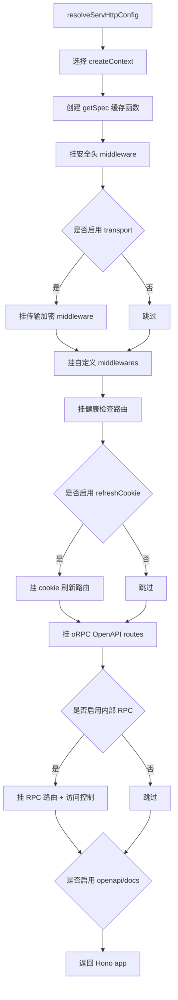

# @h-ai/serv 执行流程与关键逻辑

> 面向维护者的深度说明：解释 `serv` 模块如何装配 Hono + oRPC 运行时、有哪些内置能力、外部如何接入，以及传输加解密链路的完整执行过程。

## 模块定位

`@h-ai/serv` 是 hai-framework 的 API 服务运行时。它不负责定义业务契约本身，而是把：

- `@h-ai/api-contract` 提供的 oRPC contract
- 各业务模块提供的 procedures
- `@h-ai/core` 的 `HaiResult`、错误模型和 logger
- `@h-ai/crypto` 的传输加密能力

装配成一个可直接对外提供 HTTP API 的 Hono 应用。

简单说，它是“**把 contract 变成真正服务**”的那一层。

## 对外暴露的使用方式

### 入口与子路径导出

`packages/serv/package.json` 当前对外暴露四类入口：

- `@h-ai/serv`：扁平入口，提供 `serv.createApp()`、`serv.implement()`、`serv.listen()` 等主 API
- `@h-ai/serv/features/iam`：内置 IAM procedures
- `@h-ai/serv/features/storage`：内置 Storage procedures
- `@h-ai/serv/features/ai`：内置 AI procedures

### 最常见的外部接入方式

1. 先在应用层组合 contract。
2. 再注入业务模块实例，生成 procedures。
3. 最后调用 `serv.createApp()` 装配 Hono app。
4. Node 环境用 `serv.listen()` 启动；Fetch-first 运行时用 `serv.toFetch()` 导出。

```ts
import { apiContract } from '@h-ai/api-contract'
import { serv } from '@h-ai/serv'
import { createIamProcedures } from '@h-ai/serv/features/iam'
import { createStorageProcedures } from '@h-ai/serv/features/storage'

const contract = apiContract.create({
  iam: apiContract.iam,
  storage: apiContract.storage,
})

const procedures = {
  iam: createIamProcedures({ iam }),
  storage: createStorageProcedures({ storage }),
}

const app = serv.createApp({
  contract,
  procedures,
  iam,
  http: { apiPrefix: '/api/v1', openapi: { path: '/openapi.json' } },
})

serv.listen(app, { onClose: closeApp })
```

### 认证接入优先级

`serv.createApp()` 的上下文工厂选择顺序非常关键：

1. `createContext`：调用方完全接管上下文构造
2. `verifyToken`：自定义 access token 校验
3. `iam.session.verifyToken`：推荐方案，直接传顶层 `iam`
4. 都没有时：仅解析请求元数据，不注入 `session`

这意味着：

- 要最快接入认证：传 `iam`
- 要自定义认证实现：传 `verifyToken`
- 要接入多租户、额外上下文字段：传 `createContext`

## 内置模块与职责分层

### 核心运行时文件

- `src/serv-main.ts`：扁平入口，暴露 `serv` 命名空间，隐藏内部目录结构
- `src/serv-router.ts`：从 contract 推导 route，并完成 handler、guard 与 router 装配
- `src/serv-app.ts`：应用装配器，把 config、context、middleware、routes、docs 组装为 Hono app
- `src/serv-context.ts`：上下文工厂，解析请求头、提取 token、校验 session
- `src/pipelines/serv-pipeline-types.ts`：pipeline 共享类型（HTTP middleware / procedure handler）
- `src/pipelines/serv-pipeline-helper.ts`：pipeline 公共 helper（`mapHaiError`、`buildHaiErrorBody`）
- `src/pipelines/serv-pipeline-guard.ts`：route 认证、权限、角色 guard 与异常映射
- `src/pipelines/*.ts`：其余 HTTP pipeline（安全头、内部 RPC 等）
- `src/serv-transport.ts`：传输加密，负责密钥协商、请求解密、响应加密
- `src/serv-cookie-auth.ts`：refresh cookie 传输，负责登录写 cookie、刷新 token、退出时清 cookie
- `src/serv-openapi.ts`：文档生成，负责 OpenAPI 3.1 spec 与 Scalar HTML
- `src/adapters/serv-adapter-node.ts`：Node 适配，负责启动 HTTP 服务和优雅关闭
- `src/adapters/serv-adapter-fetch.ts`：Fetch 适配，负责导出 `fetch(Request)` 处理器

### 内置 feature procedures

- `src/features/serv-feature-iam.ts` → `@h-ai/serv/features/iam`：登录、登出、当前用户、用户/角色/权限 CRUD
- `src/features/serv-feature-storage.ts` → `@h-ai/serv/features/storage`：预签名上传/下载、文件列表、元数据、删除
- `src/features/serv-feature-ai.ts` → `@h-ai/serv/features/ai`：对话补全、发消息、历史、记忆、会话列表

这些 feature 是“开箱即用的默认装配”，不是强制依赖。调用方可以：

- 直接复用它们，快速搭 API
- 或只复用 `serv` 的运行时能力，自行实现 procedures

## `createApp()` 的装配流程

`src/serv-app.ts#createApp()` 是整个模块最重要的入口，执行顺序如下。



### 逐步说明

1. **解析 HTTP 配置**
   - `resolveServHttpConfig()` 负责填充默认值。
   - `apiPrefix` 默认 `/api/v1`。
   - `health` 默认 `/health`、`/ready`。
   - `openapi`、`docs`、`rpc` 默认关闭。

2. **决定请求上下文工厂**
   - `createApp()` 会根据 `createContext`、`verifyToken`、`iam` 选择 `CreateServContext`。
   - 这一步决定后续请求是否能拿到 `context.session`。

3. **准备 OpenAPI spec 懒缓存**
   - `generateSpec()` 只在真正访问 `/openapi.json` 或 `/docs` 时执行一次。
   - 这样可以避免启动阶段做不必要的重活。

4. **挂基础安全头**
   - `securityHeaders()` 对所有响应统一补上 `nosniff`、`DENY`、`no-referrer`。

5. **按需挂载传输加密**
   - 如果提供 `transport: { crypto }`，会先创建服务端加密管理器。
   - 再把加解密 middleware 挂在业务路由之前。
   - 同时开放 `${apiPrefix}/_hai/key-exchange` 密钥协商端点。

6. **挂自定义 middlewares**
   - 如果提供 `middlewares`，会在内置 `securityHeaders` / `transport` 之后、业务路由之前按数组顺序注册。
   - 适合放请求日志、CORS、限流、租户头校验等 HTTP 层横切逻辑。

7. **挂健康检查路由**
   - 默认提供 `/health` 和 `/ready`。

8. **挂 refresh cookie 相关路由**
   - 如果启用了 `refreshCookie`，会在 oRPC 通配符路由之前注册 login、logout、refresh 的 cookie 处理逻辑。

9. **挂主 API 路由**
   - `mountOpenAPIRoutes()` 把所有 `${apiPrefix}/*` 请求交给 oRPC 的 `OpenAPIHandler`。

10. **按需挂内部 RPC 路由**

- 如果启用 `rpc`，会先经过 `requireInternalRPC()` 做来源限制。
- 通过后再进入 `RPCHandler`。

11. **按需挂 OpenAPI JSON / 文档页**

- `openapi.path` 返回 spec。
- `docs.path` 返回 Scalar 文档页面。
- 若 `docs.requireAuth === true`，文档页也必须先通过 session 校验。

## 单次业务请求的执行流程

以下流程以“进入 `${apiPrefix}/*` 的普通业务请求”为例。

### 不启用传输加密时

1. 请求进入 Hono。
2. `securityHeaders()` 先挂好响应头。
3. 若配置了自定义 `middlewares`，它们会先于 health / docs / oRPC / RPC 路由执行。
4. `handleORPC()` 调用 `createContext({ request })` 生成 `ServContext`。
5. oRPC 根据 contract 匹配 procedure。
6. 链式 router 在进入 handler 前执行该 route 声明的 auth / permission / role guard。
7. 如果是输入校验错误，`localizeValidationResponse()` 会把默认 oRPC 400 错误改写成本地化的 `HaiResult` 失败体。
8. 最终返回 JSON 响应。

### 启用传输加密时

1. 请求先经过 `createTransportMiddleware()`。
2. 若是密钥协商端点，直接走协商流程，不进入业务处理。
3. 若是排除路径（例如健康检查），直接跳过加解密。
4. 普通业务请求必须带 `X-Client-Id`，并且服务端必须已经保存该客户端公钥。
5. 若请求有 body，middleware 先解密并重写 `c.req.raw`。
6. 下游 oRPC / Hono 逻辑看到的是**明文 JSON 请求**。
7. 下游生成 JSON 响应后，middleware 再尝试把响应加密；无法加密时 fail-closed，返回错误而不是明文透传。
8. 客户端收到的是密文 payload，由 `@h-ai/api-client` / `@h-ai/crypto` 侧解密回明文。

## 认证与上下文填充逻辑

`src/serv-context.ts` 把上下文分成两层。

### `parseRequestContext()`

只做同步元数据解析：

- `x-request-id`
- `accept-language`
- `x-forwarded-for` / `x-real-ip`
- `user-agent`
- `Authorization: Bearer <token>`

**它不会填 `session`。**

### `buildAuthContextFactory(verifyToken)`

在基础上下文上追加认证：

1. 调 `parseRequestContext()` 提取元数据和 `accessToken`。
2. 没 token：直接返回基础上下文。
3. 有 token：调用 `verifyToken(accessToken)`。
4. 校验成功：把结果写入 `context.session`。
5. 校验失败或抛错：按未认证处理，返回无 `session` 的上下文。

这套设计有两个安全特点：

- **每个请求都重新验 token，不缓存 session**
- **失败时 fail closed**：不会因为校验异常而误判成已登录

## 链式 Router 如何接管授权逻辑

`serv.implement(contract).context<ServContext>()` 从 contract 推导全部点路径与每条 route
的 input/output。公开 route 直接注册 handler；认证授权 route 在同一条链上声明 guard：

```ts
serv
  .implement(contract)
  .context<ServContext>()
  .route('health', healthHandler)
  .route('users.update')
  .permission('users.write')
  .role('admin')
  .handle(updateUserHandler)
  .build()
```

执行规则：

1. `.auth()` 依赖 `context.session`；没有 session 时返回 401。
2. `.permission()` / `.role()` 隐含认证，分别检查 session permissions / roles。
3. 同一类别声明多个 guard 时按 AND 校验，通配符 `*` 可放行该类别。
4. guard 通过后 handler 中的 `context.session` 自动收窄为非空。
5. 所有 route 的未处理异常统一转成 INTERNAL_ERROR HaiResult。
6. 编译期拒绝未知/重复/遗漏 route；运行时也会拒绝未知、重复和缺失路径。

## 内置 feature procedures 的关键逻辑

### IAM feature

`createIamProcedures()` 提供四组默认路由：

- `auth`：登录、OTP 登录、登出、当前用户、刷新、注册、改密、更新当前用户
- `users`：列表、详情、创建、更新、删除、重置密码
- `roles`：列表、详情、创建、更新、删除
- `permissions`：列表、详情、创建、删除

几个值得注意的内置策略：

- `logout/currentUser/changePassword/updateCurrentUser` 都要求已认证
- `users/roles/permissions` 默认使用 `.permission(...)` 保护
- 删除用户时会阻止“自己删自己”
- 创建用户时若后续绑定角色失败，会尝试回滚，避免留下脏数据

### Storage feature

`createStorageProcedures()` 默认提供：

- 预签名上传 / 下载 URL
- 文件列表
- 文件元数据
- 单个/批量删除

内置逻辑重点：

- 所有入口默认至少声明 `.auth()`
- 对 key 做二次安全校验，拒绝 `..`、绝对路径、反斜杠、NUL 字节
- **默认并不自动做租户隔离**，生产环境应在应用层再按 `context.session.userId` 收紧 key 前缀

### AI feature

`createAiProcedures()` 默认提供：

- 对话补全
- 发送消息
- 历史记录查询
- 记忆 recall / list
- 会话列表

主要作用是把 `@h-ai/ai` 的返回结构转换成 `@h-ai/api-contract` 对外协议需要的响应结构。

## 传输加解密处理逻辑

这是用户特别关心的部分，单独展开。

### 启用方式

```ts
const app = serv.createApp({
  contract,
  procedures,
  transport: { crypto },
})
```

启用后，serv 会在内部：

1. 调 `crypto.transport.createServer()` 创建服务端管理器。
2. 挂载密钥协商端点。
3. 在业务请求进入前尝试解密。
4. 在业务响应返回后尝试加密。

### 密钥协商流程

密钥协商入口默认为 `${apiPrefix}/_hai/key-exchange`。

服务端处理逻辑在 `src/serv-transport.ts#handleKeyExchange()`：

1. 读取请求体 JSON。
2. 要求携带 `clientPublicKey`。
3. 调 `manager.registerClientKey(clientPublicKey)`。
4. 生成并返回 `clientId` 和 `serverPublicKey`。

后续客户端要用这个 `clientId` 放到请求头里。

### 请求解密流程

普通业务请求进入 middleware 后，按以下顺序处理：

1. **排除特殊路径**
   - key exchange 和 `excludePaths` 命中的路径直接跳过。

2. **校验客户端身份**
   - 读取 `TRANSPORT_PROTOCOL.CLIENT_ID_HEADER`，也就是客户端 ID 头。
   - 缺少 `clientId` 时返回 400。
   - 找不到已注册公钥时也返回 400。

3. **解密请求体**
   - 仅对 `POST`、`PUT`、`PATCH`、`DELETE` 这类有 body 的请求处理。
   - 检查加密标记头是否存在。
   - 读取 JSON payload。
   - 校验 payload 是否符合 `EncryptedPayload` 结构。
   - 调 `manager.decryptRequest(payload)` 解密。

4. **把明文 request 塞回 Hono 上下文**
   - `decryptRequestInPlace()` 会重建一个新的 `Request`。
   - 它会把明文 JSON body 与修正后的 headers 写回 `c.req.raw`。
   - 这样下游 handler 不需要知道“上游其实传来的是密文”。

### 响应加密流程

下游业务逻辑执行完后，middleware 会继续尝试加密响应：

1. 只允许 `application/json` 响应进入加密流程；非 JSON 业务响应会返回加密失败错误。
2. 若 `Content-Length` 明确大于 `1 MiB`，直接返回加密失败错误。
3. 若没有 `Content-Length`，会克隆响应并读取 body，再做一次体积判断。
4. 调 `manager.encryptResponse(clientId, bodyText)` 加密。
5. 写回新的 `Response`，并设置加密标记 header。

### 为什么超过 `1 MiB` 会 fail-closed

这是有意的保护策略，原因很朴素：

- 响应加密需要先把 JSON body 读到内存里
- 大 body 会带来额外内存放大
- 因此超过上限时返回加密失败错误，既保证服务稳定性，也避免明文业务数据泄露

### 不会加密但允许返回的情况

以下情况不会走响应加密，且不会泄露业务明文：

- key exchange 路由
- `excludePaths` 命中的路径
- 空响应体

非 JSON 业务响应、响应体超过 1 MiB 或 `encryptResponse()` 失败都会返回错误。

### 多节点部署注意事项

服务端会把协商得到的客户端密钥信息保存在**进程内**的传输管理器中，因此多副本部署时需要额外保证：

- 使用 sticky session
- 每个节点都各自做一轮密钥协商
- 后续引入分布式密钥存储

否则客户端在 A 节点协商成功、下一次请求打到 B 节点时，B 节点可能找不到该 `clientId` 对应的密钥。

## Refresh Cookie 逻辑（补充）

`src/serv-cookie-auth.ts` 只负责 **refresh token 的 cookie 化传输**，不负责 access token 校验。

其核心流程是：

1. 登录或注册成功后，从响应体里提取 `refreshToken`。
2. 通过 `Set-Cookie` 写入 httpOnly cookie。
3. 同时把响应 JSON 里的 `refreshToken` 擦除。
4. 调用 `/auth/refresh` 时，从 cookie 里读取 refresh token。
5. 调 `iam.session.refresh()` 或 `refreshCookie.onRefresh()` 换发新 token。
6. 更新 cookie，并把响应体里的 `refreshToken` 再次擦除。

这样浏览器端 JS 只拿到 access token，不会直接接触长期有效的 refresh token。

## 推荐的源码阅读顺序

如果要真正理解 `serv`，推荐按下面顺序看源码：

1. `src/serv-main.ts`：看对外 API 面
2. `src/serv-app.ts`：看整体装配流程
3. `src/serv-context.ts`：看上下文与认证注入
4. `src/serv-router.ts` + `src/pipelines/serv-pipeline-guard.ts`：看 route 推导、认证授权与异常映射
5. `src/serv-transport.ts`：看加解密链路
6. `src/serv-cookie-auth.ts`：看 refresh cookie 处理
7. `src/features/*.ts`：看内置业务 procedures

## 关键测试与验证点

当前仓库里，下面这些测试最能说明 `serv` 的行为边界：

- `tests/serv-app.test.ts`：健康检查、安全头、受保护 docs 页面、Scalar 脚本挂载
- `tests/serv-transport.test.ts`：密钥协商、端到端加密 roundtrip、大响应体跳过加密
- `tests/pipeline-orpc.test.ts`：内部异常映射 helper 行为
- `tests/serv-router.test.ts`：route 推导、完整性约束、认证授权与异常映射

## 一句话总结

`serv` 的核心不是“再造一个 Web 框架”，而是把 hai-framework 里已经存在的 contract、认证、错误模型、文档和可选传输加密能力，装配成一条**稳定、可验证、可扩展**的 API 执行流水线。
